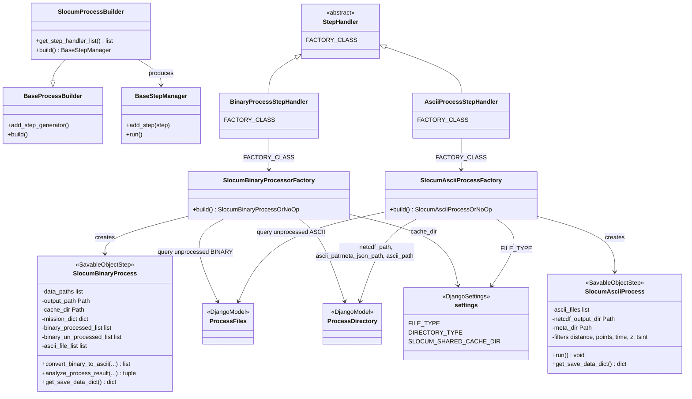
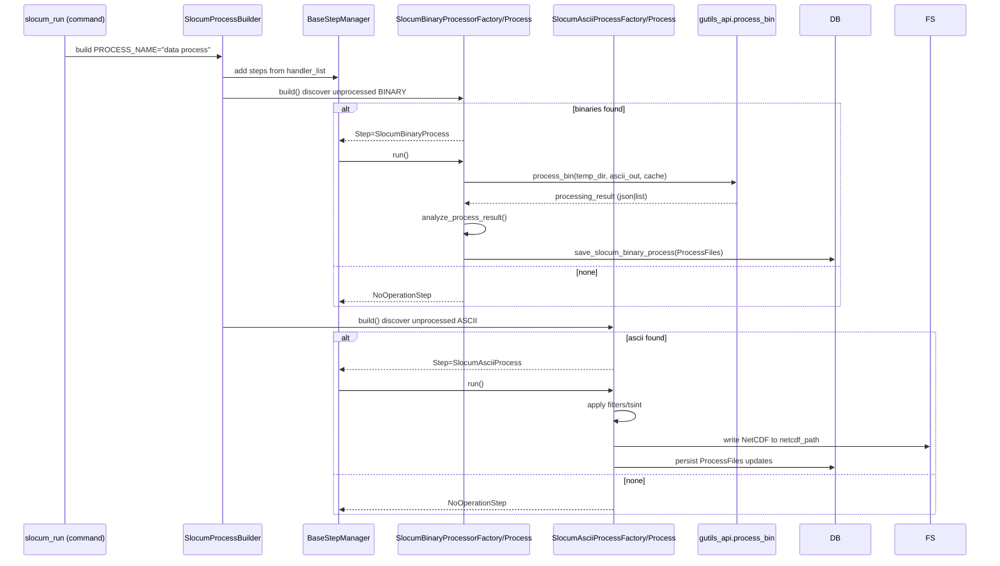
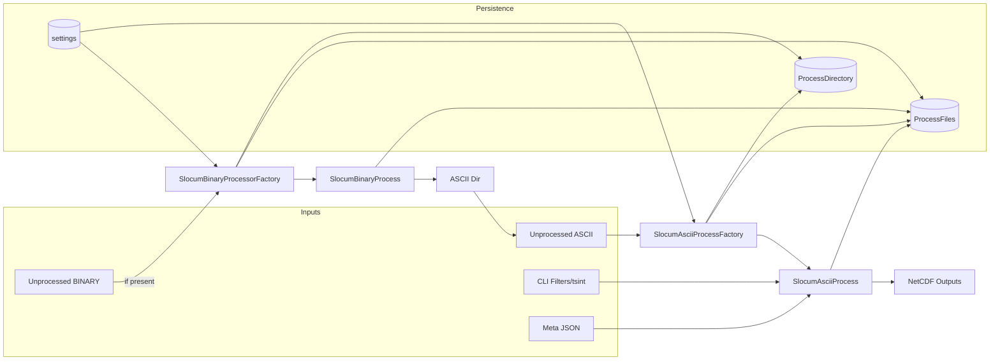

### Core Processing in the Glider Data Pipeline (GDP)

This document provides an in‑depth, implementation‑oriented overview of GDP’s core processing stage. It explains how
steps are assembled and executed, what the factories and handlers do, where inputs/outputs live, and how errors and
persistence are handled. It includes Mermaid diagrams suitable for GitHub Pages.

---

### Scope of “Core Processing”

Core processing is the middle stage of a mission run, executed after pre‑processing and before post‑processing. For
Slocum missions it consists of two primary paths:

- Binary → ASCII conversion (optional, when binary data exist/unprocessed)
- ASCII → NetCDF processing (primary data production path)

Both paths are added to the pipeline by a dedicated process builder and implemented through step handlers and factories.

---

### Key Files and Classes

- Process builder (Slocum core stage):
    - `gdp/core/process/data_process_builder.py` → `SlocumProcessBuilder`
- Core processing step handlers (list and registration):
    - `gdp/contrib/step_handlers/data_process_step_handlers.py` → `BinaryProcessStepHandler`, `AsciiProcessStepHandler`,
      exported as `handler_list`
- Processor factories and steps (Slocum):
    - `gdp/contrib/step_implementation/slocum_processor_handler/factory.py` → `SlocumBinaryProcessorFactory`,
      `SlocumAsciiProcessFactory`
    - `gdp/contrib/step_implementation/slocum_processor_handler/slocum_processor_handler.py` → `SlocumBinaryProcess`,
      `SlocumAsciiProcess`
- Supporting models and settings:
    - `gdp.models.ProcessFiles`, `gdp.models.ProcessDirectory`
    - `settings.FILE_TYPE`, `settings.DIRECTORY_TYPE`, `settings.SLOCUM_SHARED_CACHE_DIR`
- Engine callouts:
    - Binary conversion: `gdp.engine.slocum.engine.interface.gutils_api.process_bin(...)`

---

### Orchestration at a Glance

- `SlocumProcessBuilder(BaseProcessBuilder)` sets `PROCESS_NAME = "data process"` and imports
  `data_process_step_handler_list` from `gdp.contrib`.
- Handler list (order defines execution plan):
    1) `BinaryProcessStepHandler` → builds `SlocumBinaryProcess` via `SlocumBinaryProcessorFactory` when unprocessed
       binary files exist.
    2) `AsciiProcessStepHandler` → builds `SlocumAsciiProcess` via `SlocumAsciiProcessFactory` when unprocessed ASCII
       files exist.
- Each factory decides whether to produce a real Step or a `NoOperationStep` (idempotent chain composition).

---

### Class/Component Diagram (Core Processing)

---

### Binary → ASCII Path

Implemented by `SlocumBinaryProcessorFactory` and `SlocumBinaryProcess`.

- Discovery (Factory):
    - Uses `ProcessFiles.objects.get_unprocessed_file(deployment_number, mission_type, FILE_TYPE["BINARY"])` and filters
      out missing paths.
    - Output ASCII path via
      `ProcessDirectory.get_process_dir(mission_type, deployment_number, DIRECTORY_TYPE["ascii_path"])`.
    - Cache via `settings.SLOCUM_SHARED_CACHE_DIR`.
    - If files exist → produce `SlocumBinaryProcess`; else → `NoOperationStep`.

- Execution (Process):
    - For each batch, link input files into a temporary working directory (`gdp.component.file.utils.make_link`) to
      avoid moving sources.
    - Call engine: `gdp.engine.slocum.engine.interface.gutils_api.process_bin(temp_dir, output_dir, cache_file_paths)`.
    - Analyze results with `analyze_process_result(...)`:
        - Normalizes JSON vs list return types from engine
        - Maps processed binary basenames to original absolute paths (robust to relative path changes)
        - Produces three lists: processed binaries, unprocessed binaries, and generated ASCII files
    - Persist via `SavableObjectStep` contract using model info:
        - `MODEL_NAME = "ProcessFiles"`, `MODEL_FUNCTION = "save_slocum_binary_process"`
        - `get_save_data_dict()` merges processed + unprocessed lists and associates ASCII outputs with mission context

- Output:
    - New `.dat`/ASCII files in mission’s ASCII directory
    - Updated `ProcessFiles` rows for BINARY and ASCII entries
    - Cache artifacts reused across runs

- Idempotency and safety:
    - Re‑running skips already‑processed binaries (they will not appear in “unprocessed” query)
    - Missing files are filtered early; engine exceptions produce mission‑scoped errors accumulated by the runner

---

### ASCII → NetCDF Path

Implemented by `SlocumAsciiProcessFactory` and `SlocumAsciiProcess`.

- Discovery (Factory):
    - Ensures manually added ASCII files are tracked: scans ASCII directory and creates `ProcessFiles` rows for any
      `.dat` file not already recorded (`scan_ascii_dir_for_manually_added_file`) — keeps DB consistent with filesystem.
    - Queries list of unprocessed ASCII entries via `ProcessFiles.get_unprocessed_file(..., FILE_TYPE["ASCII"])`,
      filters missing files, sorts by name (stable ordering) using `gdp.component.utils.sort_tool.sort_names`.
    - Resolves output directories via `ProcessDirectory`: `DIRECTORY_TYPE["netcdf_path"]` and
      `DIRECTORY_TYPE["meta_json_path"]`.
    - Pulls filter options from the command:
        - `filter_distance`, `filter_points`, `filter_time`, `filter_z`, `tsint`
    - If files exist → produce `SlocumAsciiProcess`; else → `NoOperationStep`.

- Execution (Process):
    - Consumes ordered ASCII files; applies filtering/decimation according to command options.
    - Enriches with meta found under `meta_json_path` as needed.
    - Produces NetCDF files in `netcdf_path` (naming convention driven by internal processors and mission metadata).
    - Persists results via `SavableObjectStep` using step’s `MODEL_NAME`/`MODEL_FUNCTION` (see class; not shown fully
      here) and `get_save_data_dict()` that records produced NCs and updates ASCII file statuses.

- Output:
    - Mission NetCDF products in `DIRECTORY_TYPE["netcdf_path"]`
    - Updated `ProcessFiles` rows linking ASCII inputs to NC outputs

- Filters and Quality Controls:
    - `filter_distance` (m), `filter_points` (count), `filter_time` (s), `filter_z` (depth constraint), `tsint` (time
      bin interval)
    - These are applied/propagated by `SlocumAsciiProcess`; exact algorithms live in the Slocum engine layer and/or in
      step utilities.

---

### Sequence Diagram — End‑to‑End (Core Stage, Slocum)

---

### Data and Persistence Model Interactions

- `ProcessFiles`
    - Tracks file paths and statuses per `mission_type` and `deployment_number`
    - Queried by factories to find “unprocessed” inputs
    - Updated by processes to mark files processed and to register newly created products

- `ProcessDirectory`
    - Resolves canonical directories by `DIRECTORY_TYPE` (e.g., `ascii_path`, `netcdf_path`, `meta_json_path`)
    - Decouples path layout from code; paths can vary by deployment/environment

- `settings`
    - `FILE_TYPE`: e.g., `BINARY`, `ASCII`; ensures consistent type keys across code and DB
    - `DIRECTORY_TYPE`: defines named directory roles (ASCII, NetCDF, meta, cache)
    - `SLOCUM_SHARED_CACHE_DIR`: cache location for binary processing

- `SavableObjectStep`
    - Base for steps that know how to persist themselves via `MODEL_NAME` and `MODEL_FUNCTION`
    - Each process provides a `get_save_data_dict()` for the saving function

---

### Error Handling and Robustness

- Factories degrade to `NoOperationStep` when there is nothing to do (keeps the chain stable and idempotent).
- Binary engine output normalization: `SlocumBinaryProcess.analyze_process_result` tolerates engine returning either a
  list or JSON string; de‑duplicates by basename to avoid path mismatches.
- Missing files are filtered early (filesystem existence checks). Stale DB rows for absent files are deleted in the
  ASCII factory.
- Runner aggregates step exceptions and reports per‑mission failures (`MissionRunner.raise_error`).

---

### Extensibility Patterns

- Add another processing modality (e.g., alternative ASCII → NC algorithm):
    - Create a new factory and step under `gdp/contrib/step_implementation/<your_module>/...`
    - Implement `Factory.build()` to discover inputs and return either a Step or a NoOp
    - Implement `Step.run()` and `get_save_data_dict()`; declare `MODEL_NAME`/`MODEL_FUNCTION` if persisting
    - Register a new StepHandler in `gdp/contrib/step_handlers/data_process_step_handlers.py` and add it to
      `handler_list` in the desired order

- Tune selection/order:
    - The handler list order in `data_process_step_handlers.py` establishes precedence (e.g., ensure Binary→ASCII
      precedes ASCII→NC)

---

### Inputs and Outputs (Summary)

- Inputs
    - CLI options: filtering (`--filter_distance`, `--filter_points`, `--filter_time`, `--filter_z`), `--tsint`, mode
      switches
    - `ProcessFiles` entries for BINARY/ASCII; ASCII directory scan for unmanaged files
    - Mission metadata directory for enrichment

- Outputs
    - ASCII files (if binary inputs exist) under `ascii_path`
    - NetCDF data products under `netcdf_path`
    - Updated `ProcessFiles` records and any cache artifacts

---

### Data Flow (Core Stage)

---

### Practical Tips

- If NetCDFs aren’t being produced:
    - Confirm ASCII factory found files (check logs and that ASCII directory is correct)
    - Ensure filters/`tsint` aren’t excluding all data
    - Verify `ProcessDirectory` paths and permissions
- If binary files aren’t converting:
    - Inspect cache dir (`SLOCUM_SHARED_CACHE_DIR`) and engine logs
    - Check that `ProcessFiles` has BINARY entries and that they exist on disk
- For historical backfills, you can supply explicit mission lists and run repeatedly; idempotent discovery ensures only
  remaining files are processed.

