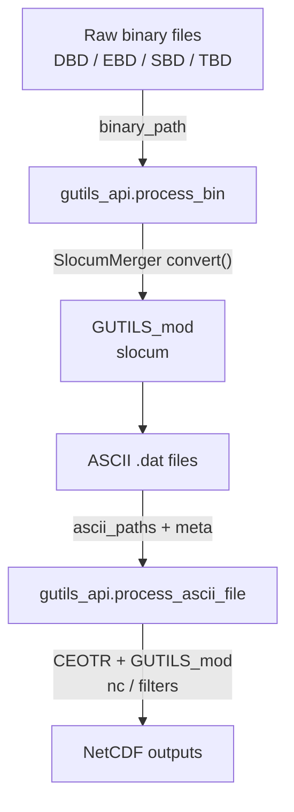
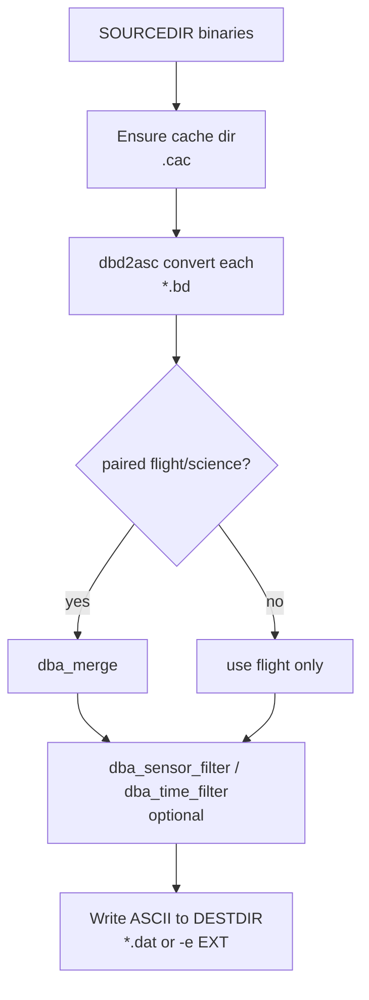
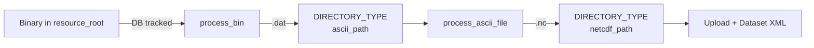
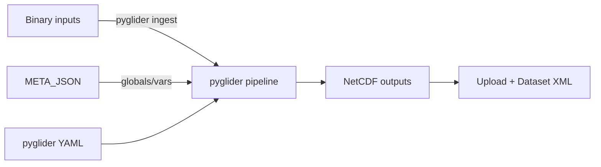

### GUTILS_mod in GDP — Implementation Guide, Script Details, and Migration Notes

This document explains how `GUTILS_mod` is wired into the GDP project, how its key files and scripts (notably
`convertDbds.sh`) work, how GDP calls into them via Python wrappers, and what to watch for when migrating to `pyglider`
in a planned revamp.

---

### What is GUTILS_mod and why is it here?

`GUTILS_mod` is a vendored, slightly customized fork of the Slocum glider utilities originally designed to:

- Convert Slocum binary telemetry (DBD/EBD for delayed; SBD/TBD/MBD/NBD for realtime) into ASCII table files
- Read and interpret those ASCII tables into structured data
- Apply filtering and profiling logic (e.g., assigning profiles, removing bad points)
- Generate NetCDF outputs adhering to CF conventions

In GDP, `GUTILS_mod` supplies the conversion/reading/processing machinery used by the Slocum engine layer.

Key directories and files:

- `GUTILS_mod/gutils/slocum/bin/*` — legacy shell+native tools (e.g., `convertDbds.sh`, `dbd2asc`, `dba_merge`)
- `GUTILS_mod/gutils/slocum/__init__.py` — Python `SlocumReader` and helpers
- `GUTILS_mod/gutils/nc.py`, `filters.py`, `yo.py`, `ctd.py` — processing, filtering, and CTD calculations
- Templating for ERDDAP (historical) under `GUTILS_mod/gutils/templates/*` (GDP now uses its own ERDDAP layer)

---

### Where GDP integrates with GUTILS_mod

Primary integration points inside GDP:

- Binary → ASCII conversion (Python wrapper):
    - `gdp/engine/slocum/engine/interface/gutils_api.py :: process_bin(binary_path, ascii_path, cache_directory)`
    - Uses `from GUTILS_mod.gutils.slocum import SlocumMerger` to convert binaries to `.dat` ASCII
- ASCII → NetCDF generation (CEOTR layer building on GUTILS_mod):
    - `gdp/engine/slocum/engine/interface/gutils_api.py :: process_ascii_file(...)`
    - Imports CEOTR overrides:
        - `CEOTRSlocumReader` (wraps/extends `GUTILS_mod.gutils.slocum.SlocumReader`)
        - `create_dataset` (from `gdp/engine/slocum/engine/slocum/ceotr_gutils/ceotr_nc.py`) which in turn uses
          `GUTILS_mod.gutils.nc` utilities and filters
    - Filters and profile handling use:
        - `GUTILS_mod.gutils.filters` and `GUTILS_mod.gutils.yo.assign_profiles`
- Supporting references in CEOTR code:
    - `gdp/engine/slocum/engine/slocum/ceotr_gutils/ceotr_filters.py` (imports GUTILS filters)
    - `gdp/engine/slocum/engine/slocum/ceotr_gutils/slocum_reader_overwrite.py` (imports `SlocumReader`)

GDP orchestration that wraps the engine:

- Factories/steps build context directories, call `process_bin` and `process_ascii_file`, then persist results via
  `ProcessFiles` and `ProcessDirectory`.
    - Binary path and cache path mapping: `settings.SLOCUM_SHARED_CACHE_DIR` → GUTILS cache; ASCII output path →
      `DIRECTORY_TYPE["ascii_path"]`.

#### GDP ↔ GUTILS_mod Integration

---

### The legacy shell tooling: convertDbds.sh and companions

Path: `GUTILS_mod/gutils/slocum/bin/convertDbds.sh`

Purpose: A comprehensive shell pipeline that converts and merges native Slocum binary flight/science data into ASCII
files, invoking vendor (TWRC) executables and auxiliary scripts.

Key options (from script usage):

- `-f FILE` — sensor filter list; only include sensors named in this file
- `-c DIR` — cache directory for generated `.cac` sensor list files (defaults to `SOURCEDIR/cache`)
- `-m` — write MATLAB‑formatted ASCII instead of default DBA format
- `-e EXT` — alternate ASCII extension (default `dat`)
- `-b DIR` — path to Teledyne Webb Research (TWRC) executables for conversion/merging
- `-q` — quiet
- `-p` — print the path of each successfully converted binary file

What it does (high‑level):

- Scans the source directory for controller pairs: `dbd/ebd`, `mbd/nbd`, `sbd/tbd`
- Ensures a cache dir for `.cac` files (sensor selection/index files)
- Invokes `dbd2asc` (or equivalent) from TWRC executables to convert individual binaries to ASCII
- Applies optional sensor filters (`dba_sensor_filter`) or time trimming (`dba_time_filter`) when requested
- Merges flight/science ASCII using `dba_merge` to produce final per‑segment ASCII
- Normalizes output naming and file permissions

Companion binaries in `slocum/bin`:

- `dbd2asc` — vendor converter from D*BD to ASCII
- `dba_merge` — merges paired flight (dbd/sbd/mbd) and science (ebd/tbd/nbd)
- `dba_sensor_filter` — select a subset of sensors
- `dba_time_filter` — time‑window filtering
- `rename_dbd_files`, `dba2_*` — assorted historical helpers

How this relates to GDP’s Python path:

- GDP does NOT call `convertDbds.sh` directly; instead it leverages `SlocumMerger.convert()` which encapsulates similar
  logic in Python.
- The Python wrapper provides better error handling, portability, and integration with GDP’s DB tracking and cache
  management.

#### convertDbds.sh internal flow (conceptual)

---

### Dataflow across GDP with GUTILS_mod

- Pre‑processing determines source directories and prepares ASCII output dir (`ProcessDirectory`), tracking discovered
  binaries (`ProcessFiles`).
- Core processing:
    1) `process_bin(...)` converts binaries to ASCII via `SlocumMerger.convert()`; returns processed/unprocessed lists
       for DB updates.
    2) `process_ascii_file(...)` reads ASCII with `CEOTRSlocumReader`/`GUTILS_mod`, applies filters (`filter_distance`,
       `filter_points`, `filter_time`, `filter_z`, `tsint`), and generates NetCDF.
- Post‑processing publishes NetCDF to ERDDAP and generates dataset XML.

#### End‑to‑end with key directories

---

### Caches, filters, and reproducibility

- Cache directory: `settings.SLOCUM_SHARED_CACHE_DIR` points to a shared cache used by `SlocumMerger` (analogous to `-c`
  in `convertDbds.sh`). These `.cac` files accelerate/standardize sensor mapping across repeated conversions.
- Filters: GDP exposes CLI flags mapped into `process_ascii_file(...)` parameters, which are then enforced by
  `GUTILS_mod`/CEOTR processing.
- Determinism: The pipeline registers all inputs/outputs in `ProcessFiles` and resolves directories via
  `ProcessDirectory` to ensure idempotence and reproducibility.

---

### Migration plan: GUTILS_mod → pyglider

Objective: Replace the GUTILS_mod stack with `pyglider` to modernize the pipeline while preserving outputs, semantics,
and performance.

Proposed phases:

1. Binary → ASCII conversion
    - Replace `SlocumMerger.convert()` with `pyglider` equivalents (or keep ASCII‑free path if pyglider ingests binaries
      directly)
    - Maintain cache semantics (sensor selection) — decide on `pyglider`’s config approach; migrate `.cac` concept to
      YAML/JSON configs
    - Map GDP’s `settings.SLOCUM_SHARED_CACHE_DIR` to new config/cache handling
2. ASCII/Raw → NetCDF creation
    - Adopt `pyglider`’s NetCDF writer configured to match current CF conventions and variables
    - Ensure metadata integration: feed GDP’s `META_JSON` (trajectory template, global attrs) into pyglider’s config
    - Preserve filters: distance, time, points, z, tsint — implement in pre‑writer transforms or in pyglider pipeline
3. Reader and filters
    - Retire `CEOTRSlocumReader`/GUTILS filters gradually; build adapter functions that forward GDP CLI options into
      pyglider config
4. ERDDAP layer
    - Keep as‑is; only NetCDF file conventions/locations must remain compatible
5. Backward compatibility & rollout
    - Golden‑file tests: select representative missions; diff current `.nc` vs pyglider `.nc` (variables, attrs, dims,
      checksums where feasible)
    - Performance tests: wall‑clock and memory profile on typical/large missions
    - Staged deployment: feature flag to switch engines; dry‑run mode to compare artifacts without publishing

Feature parity and risks:

- Sensor mapping differences: pyglider channel names or QC logic may differ from GUTILS_mod — reconcile via config
- CF conventions: ensure identical `standard_name`, `units`, `long_name`, fill values, `Conventions`, and global history
- Time handling: exact epoch and rounding behavior must be verified to avoid off‑by‑one sample shifts
- Profile assignment: ensure equivalent profile segmentation (yo detection) vs `GUTILS_mod.gutils.yo.assign_profiles`

#### Target architecture with pyglider

Integration steps in GDP code:

- `gdp/engine/slocum/engine/interface/gutils_api.py`
    - Add new functions `process_bin_pyglider` / `process_to_netcdf_pyglider` (or replace implementations behind same
      interface)
    - Keep return schema identical to current `process_bin` / `process_ascii_file` for minimal factory changes
- CEOTR overrides
    - Decommission CEOTR readers gradually; route through pyglider; retain local patches only if behavior gaps remain
- Factories/steps remain the same (directory resolution, DB updates) — only engine calls change

---

### Practical guidance for maintainers

- If you must run legacy conversions outside GDP, `convertDbds.sh` is self‑contained; pass a cache dir with `-c` and
  ensure TWRC executables are on disk (or use local copies in `slocum/bin`).
- In GDP’s normal path, prefer the Python API (`SlocumMerger`) for consistent error handling and DB integration.
- Before swapping to pyglider, lock a set of “reference” NetCDFs and metadata; any change in a single attribute can
  cause ERDDAP diffs.
- Document your pyglider YAMLs alongside GDP’s `META_JSON` so reviewers can trace variable/attribute provenance.

---

### File index (relevant to GUTILS_mod usage)

- Engine wrapper:
    - `gdp/engine/slocum/engine/interface/gutils_api.py` — entrypoints `process_bin`, `process_ascii_file`
- CEOTR layer depending on GUTILS_mod:
    - `gdp/engine/slocum/engine/slocum/ceotr_gutils/*` (filters, reader overwrite, nc writer)
- GUTILS_mod core:
    - `GUTILS_mod/gutils/slocum/__init__.py` — `SlocumReader`, constants, utilities
    - `GUTILS_mod/gutils/nc.py`, `filters.py`, `yo.py`, `ctd.py` — processing stack
- Legacy shell tools:
    - `GUTILS_mod/gutils/slocum/bin/convertDbds.sh` — full conversion pipeline (shell)
    - `GUTILS_mod/gutils/slocum/bin/{dbd2asc,dba_merge,dba_sensor_filter,dba_time_filter,rename_dbd_files}` — helpers