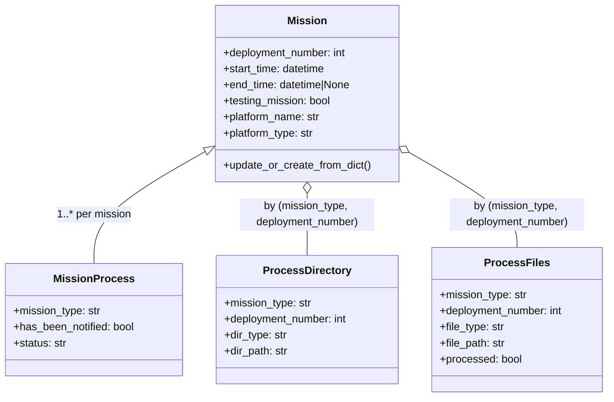
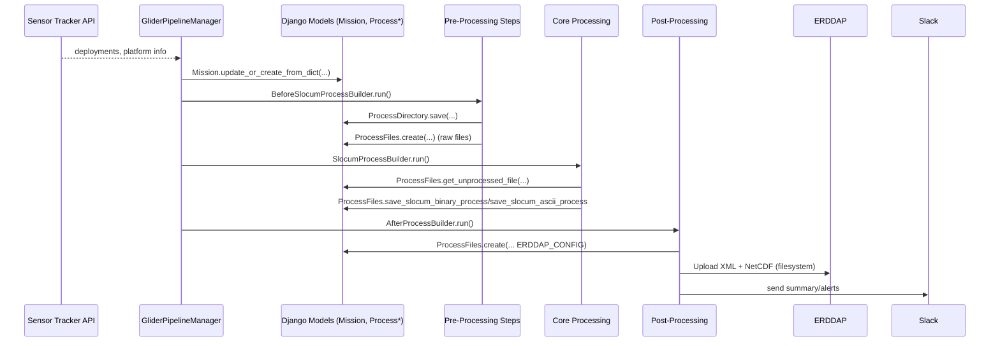
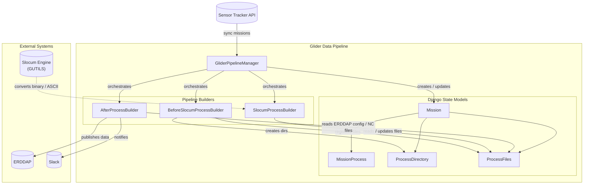

### Database Models and External Integrations — Comprehensive Guide (GDP)

This document explains all database tables (Django models) used in the Glider Data Pipeline (GDP) and the external
systems it connects to. It shows how models, managers, and external APIs relate to the pipeline builders, step handlers,
and factories.

---

### Overview

- Database (Django models in `gdp/models.py`):
    - `Mission`: authoritative mission records (deployment metadata) synced from Sensor Tracker
    - `MissionProcess`: per‑mission/per‑mode status and notification state
    - `ProcessDirectory`: canonical directories for mission resources/outputs (ASCII, NetCDF, meta, etc.)
    - `ProcessFiles`: mission‑scoped file catalog + processing status for raw/ASCII/NetCDF/XML artifacts
- External integrations:
    - Sensor Tracker API (via `SensorTrackerClientProxy`) for deployments, instruments, parameters
    - ERDDAP (filesystem upload of datasets and dataset XML)
    - Slack notifications (webhook/API client from contrib factory)
    - Slocum processing engine (gutils interface) — treated here as an external engine dependency

---

### Models and Managers (Database Layer)

All located in `gdp/models.py`.

#### Mission

- Fields:
    - `deployment_number: int`
    - `start_time: datetime`
    - `end_time: datetime | None`
    - `testing_mission: bool`
    - `platform_name: str`
    - `platform_type: str` (e.g., `slocum`, `wave`)
- Manager: `MissionManager`
    - `update_or_create_from_dict(glider_type, value)`
        - Maps Sensor Tracker deployment dict → upsert `Mission`
        - Syncs subset: `deployment_number`, `start_time`, `end_time`, `testing_mission`, `platform_name`,
          `platform_type`
- Relationships:
    - 1‑to‑many with `MissionProcess` (unique per `(mission, mission_type)`)

#### MissionProcess

- Fields:
    - `mission_type: str` — "live" or "delayed"
    - `mission: FK(Mission)`
    - `has_been_notified: bool`
    - `status: str`
- Manager: `MissionProcessManager`
    - `get_mission_process(deployment_number, mission_type)`
    - `create_mission_process(mission_obj)` — derives mission and `mission_type` from pipeline’s `command`
- Unique constraint: `unique_together = ('mission_type', 'mission')`
- Relationship to pipeline:
    - Tracks lifecycle and notifications per mission/mode; used by runners/builders to understand status

#### ProcessDirectory

- Purpose: central registry that maps a mission and directory role to an absolute path (avoids hardcoding paths across
  steps)
- Fields:
    - `mission_type: str` ("live"/"delayed")
    - `deployment_number: int`
    - `dir_type: str` (from `settings.DIRECTORY_TYPE`, e.g., `ascii_path`, `netcdf_path`, `meta_json_path`)
    - `dir_path: str`
- Manager: `ProcessDirectoryManager`
    - `create_process_directory(mission_type, deployment_number, dir_type, dir_path)`
    - `get_process_dir(mission_type, deployment_number, dir_type)`
    - `save_directories(savable_step)` — batch save from steps that produce multiple directories
- Relationships:
    - Indirectly referenced by factories/steps to resolve where to read/write files

#### ProcessFiles

- Purpose: mission‑scoped catalog of files + processing status by file type (raw BINARY/ASCII/NetCDF/XML)
- Fields:
    - `mission_type: str`
    - `deployment_number: int`
    - `file_type: str` (from `settings.FILE_TYPE`, e.g., `BINARY`, `ASCII`, `NETCDF`, `ERDDAP_CONFIG`)
    - `file_path: str`
    - `processed: bool`
- Manager: `ProcessFilesManager`
    - Creation and queries:
        - `create_process_files(mission_type, deployment_number, file_type, file_path, processed=False)`
        - `get_process_file(mission_type, deployment_number, file_type)`
        - `get_process_files(mission_type, deployment_number, file_type)`
        - `get_unprocessed_file(deployment_number, mission_type, file_type)`
    - Save/update orchestration:
        - `save_mission_paths(savable_step)` / `update_mission_paths(savable_step)`
        - `update_mission_paths_for_savable(savable_step)`
        - `_save_mission_paths(data_dict)`
    - Slocum processing shortcuts:
        - `save_slocum_binary_process(savable_step)`
        - `save_slocum_ascii_process(savable_step)`
    - Cleanup:
        - `remove_processing_files(savable_step)`
- Relationships:
    - Used by finders (pre‑processing) to register discovered raw files
    - Used by core processing to fetch unprocessed inputs and save outputs/status
    - Used by post‑processing to store `ERDDAP_CONFIG` paths and other artifacts

---

### ER/Model Diagram (Logical)

---

### External Systems and Client Code

#### Sensor Tracker (external API)

- Code: `gdp/component/util.py`
    - `from sensor_tracker_client import sensor_tracker_client as stc`
    - `from ceotr_sensor_tracker_proxy.sensor_tracker_proxy import SensorTrackerClientProxy`
    - `stc.HOST = "https://prod.ceotr.ca/sensor_tracker/"`
    - `stp = SensorTrackerClientProxy(stc)`
- Usage:
    - Pipeline Manager updates database from Sensor Tracker before selecting missions:
        - `GliderPipelineManager.update_from_sensor_tracker()` pulls deployments and calls
          `Mission.objects.update_or_create_from_dict(glider_type, value)` to upsert `Mission` rows.
    - Metadata generation (contrib/meta) queries Sensor Tracker for instruments/parameters to compile metadata JSON:
        - `gdp/contrib/step_implementation/meta/meta_generation/meta_json_generator.py` uses Sensor Tracker‑derived
          metadata
          to build instrument/sensor/parameter dictionaries (see `get_sensor_tracker_sensor_and_parameter_mix`).
- Data flow:
    - Sensor Tracker → (deployments, instruments, parameters) → GDP managers/generators → DB and metadata templates

#### ERDDAP (dataset XML and data uploads)

- Dataset XML generation/refinement:
    - `gdp/contrib/step_implementation/errdap_dataset_config/factory/*`
    - Produces mission dataset XML, saved and tracked in `ProcessFiles` with `FILE_TYPE["ERDDAP_CONFIG"]`
- Uploads (filesystem to ERDDAP server data dirs):
    - `gdp/contrib/step_implementation/errdap_data_file_upload/*`
    - NetCDFs copied/synced to ERDDAP’s data directory; dataset XML copied to ERDDAP’s dataset directory
- Relation to DB:
    - Generated XML path is stored in `ProcessFiles`
    - NetCDF files are discovered from `ProcessDirectory(..., netcdf_path)` and may be registered/tracked in
      `ProcessFiles`

#### Slack (notifications)

- Code: `gdp/contrib/step_implementation/gdp_slack_notification/factory.py`
    - Sends status messages (mission summary, errors) to a configured Slack webhook or API
- Relation to DB:
    - `MissionProcess.has_been_notified` can be used by ops flows to avoid duplicate notifications

#### Slocum Engine (gutils interface; external dependency)

- Code: `gdp/engine/slocum/engine/interface/gutils_api.py` (referenced by factories)
- Role: performs binary → ASCII conversions and supports ASCII → NetCDF computation flows
- Relation to DB:
    - Results from engine runs are written into directories resolved by `ProcessDirectory` and recorded via
      `ProcessFiles`

---

### How Models Interact With the Pipeline

- Before (pre‑processing):
    - Sensor Tracker sync: `MissionManager.update_or_create_from_dict` populates/refreshes `Mission`
    - Finder steps (realtime/delayed) write discovered raw file paths to `ProcessFiles`
    - Directory creation steps save `ProcessDirectory` entries for `ascii_path`, `netcdf_path`, `meta_json_path`, etc.

- Process (core):
    - Binary→ASCII factory queries `ProcessFiles.get_unprocessed_file(..., BINARY)` and writes ASCII outputs into
      `ProcessDirectory(..., ascii_path)`; updates `ProcessFiles` via `save_slocum_binary_process`
    - ASCII→NetCDF factory scans ASCII dir to register unmanaged `.dat` files, queries unprocessed ASCII, and writes NC
      into
      `ProcessDirectory(..., netcdf_path)`; updates `ProcessFiles` via `save_slocum_ascii_process`

- After (post‑processing):
    - ERDDAP XML generation saves path into `ProcessFiles` (`ERDDAP_CONFIG`)
    - Upload steps read from `ProcessDirectory` and `ProcessFiles` to locate files to move
    - Cleanup steps may remove intermediates; managers offer `remove_processing_files` hooks

---

### End‑to‑End Data+DB Sync With External APIs

---

### Features and Responsibilities by Table

- Mission
    - Single source of truth for deployments used by selection logic (real‑time: `end_time=None`; delayed: completed)
    - Updated from Sensor Tracker before every run

- MissionProcess
    - Mode‑specific state; suitable for tracking lifecycle (e.g., started, completed, failed) and notification gating
    - Helpers to create/obtain records from `deployment_number` + mode

- ProcessDirectory
    - Abstracts away filesystem locations; central point for path lookups by any step
    - Supports bulk save from steps that materialize directory structures

- ProcessFiles
    - Drives idempotence and incremental processing
    - Find unprocessed inputs; record new outputs; mark completion states
    - Specialized helpers for Slocum processing flows

---

### Settings That Bind Models/Steps

- `settings.FILE_TYPE` — canonical file type names used by `ProcessFiles`
    - Examples: `BINARY`, `ASCII`, `NETCDF`, `ERDDAP_CONFIG`, `META_JSON`, etc.
- `settings.DIRECTORY_TYPE` — directory roles used by `ProcessDirectory`
    - Examples: `ascii_path`, `netcdf_path`, `meta_json_path`
- `settings.REALTIME_EXTENDED`/`DELAYED_EXTENDED` — extensions used by file finder steps
- `settings.SLOCUM_SHARED_CACHE_DIR` — binary processing cache for gutils engine
- ERDDAP server dirs/hosts — consumed by upload factories (deployment‑specific)

---

### Practical Mapping: Where Things Are Used

- MissionManager.update_or_create_from_dict
    - Called by pipeline manager before mission selection
- ProcessDirectory.get_process_dir
    - Used by factories/steps to resolve paths for ASCII/NetCDF/meta
- ProcessFiles.get_unprocessed_file
    - Used by core processing factories to determine work to do
- ProcessFiles.save_slocum_binary_process / save_slocum_ascii_process
    - Called by `SavableObjectStep` implementations when persisting results
- ERDDAP factories
    - Produce XML and upload data; log and register artifacts into `ProcessFiles`
- Slack factory
    - Summarizes mission processing outcomes; may read `MissionProcess` to avoid duplicate alerts

---

### Model–Component Interaction Map

---

### Extension and Maintenance Notes

- Adding new file types/dirs:
    - Extend `settings.FILE_TYPE` / `settings.DIRECTORY_TYPE`
    - Ensure contributing steps and `ProcessFilesManager` logic are updated accordingly
- New external systems:
    - Create a light proxy module similar to `SensorTrackerClientProxy`; keep host/credentials in settings/env
    - Add dedicated managers or factories to interface with your models consistently
- Data migrations:
    - Follow Django migration best practices; keep unique constraints (e.g., on `MissionProcess`) aligned with usage