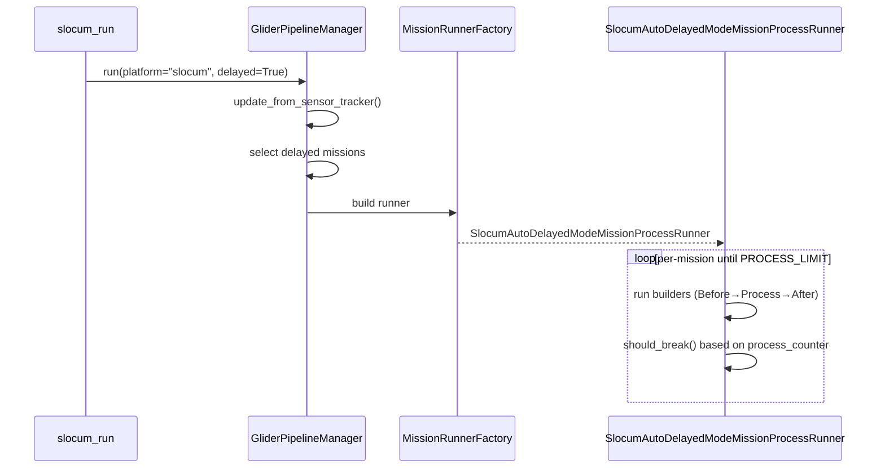
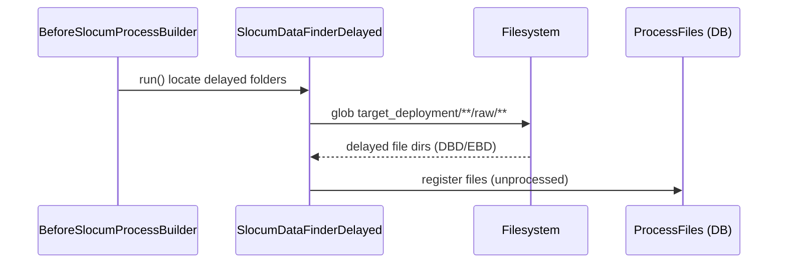
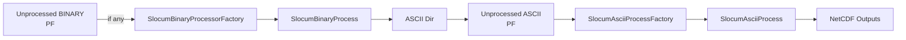
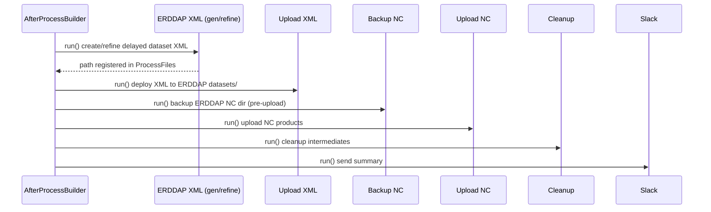

### Delayed Mode Data Processing — End‑to‑End Flow (GDP)

This document explains the delayed processing mode in the Glider Data Pipeline (GDP) from command invocation to ERDDAP
publication. It details selection of delayed missions, data discovery, core processing to NetCDF, and post‑processing (
ERDDAP config, upload, backup, cleanup, notifications).

---

### What “Delayed” Means in GDP

- Processes completed missions (high‑resolution datasets) after deployment has ended (no longer the current/live
  mission).
- Ingests delayed raw data (e.g., `DBD`, `EBD`) organized in per‑deployment directories.
- Runs full processing (less constrained than real‑time decimation), typically yielding the authoritative NetCDF archive
  for ERDDAP.
- Often triggered for the most recent completed mission, but can target explicit missions or ranges.

Key code points:

- CLI command: `gdp/management/commands/slocum_run.py`
- Manager: `gdp/core/pipeline/manager.py`
- Runner limiting (auto delayed): `gdp/core/pipeline/runners.py :: AutoDelayedModeMissionProcessRunner`,
  `SlocumAutoDelayedModeMissionProcessRunner`
- Delayed data finder: `gdp/contrib/step_implementation/file_finder/file_finder.py :: SlocumDataFinderDelayed`
- Core processing builders/steps: `gdp/core/process/data_process_builder.py` and
  `gdp/contrib/step_implementation/slocum_processor_handler/*`
- Post‑processing (ERDDAP): `gdp/core/process/after_process_builder.py`, `gdp/contrib/step_implementation/errdap_*`
- Settings: `settings.DELAYED_EXTENDED = ("DBD", "EBD")`

---

### High‑Level Flow

1) Command parses options, selects delayed mode
2) Pipeline Manager updates the Mission table from Sensor Tracker and selects delayed mission(s)
3) Builds mission(s) with three stage builders: Before (pre), Process (core), After (post)
4) Pre‑processing locates delayed raw data and prepares directories; records files
5) Core processing converts any new binaries to ASCII, then builds NetCDFs from ASCII
6) Post‑processing updates ERDDAP config (if requested), uploads NetCDFs, performs backups/cleanup, and sends
   notifications
7) Auto‑delayed runner enforces a process limit (by default, one mission per run) to bound runtime

#### End‑to‑End Flow (Delayed)

```mermaid
flowchart LR
    A["CLI: manage.py slocum_run --process_delayed_mission"] --> B["GliderPipelineManager"]
    B --> C["Sync Mission DB from Sensor Tracker"]
    B --> D["Select delayed missions<br/>ended deployments"]
    D --> E["MissionRunner auto-delayed<br/>Before → Process → After"]

    subgraph Before["Pre-Processing"]
        E1["Create local directories"] --> E2["SlocumDataFinderDelayed"]
        E2 --> E3["Register discovered files<br/>ProcessFiles"]
    end

    subgraph Process["Core"]
        P1["Binary → ASCII<br/>if new/unprocessed"] --> P2["ASCII → NetCDF"]
    end

    subgraph After["Post-Processing"]
        A1["Generate ERDDAP XML"] --> A2["Upload ERDDAP XML"]
        A2 --> A3["Backup ERDDAP NC folder"]
        A3 --> A4["Upload NetCDF files"]
        A4 --> A5["Cleanup + Slack"]
    end

    E --> E1
    E3 --> P1
    P2 --> A1
```

---

### Delayed Mission Selection & Runner Behavior

- Manager (`GliderPipelineManager.run()`):
    - Refreshes `Mission` records from the Sensor Tracker
    - Uses `SlocumMissionBuilder.get_selected_mission_list()` to pick delayed missions according to CLI options
    - Common policy: choose the latest completed deployment for the platform; explicit mission lists/ranges are also
      supported
- Runner factory (`MissionRunnerFactory.build()`):
    - For Slocum + delayed mode, returns `SlocumAutoDelayedModeMissionProcessRunner`
    - `AutoDelayedModeMissionProcessRunner.PROCESS_LIMIT = 1` bounds processing to one mission per run; `should_break()`
      checks a shared `process_counter`

#### Delayed Runner Logic

---

### Pre‑Processing in Delayed Mode

- Handler list includes `RetrieveSlocumDelayedDataStepHandler` (from
  `gdp/contrib/step_handlers/before_process_step_handlers.py`), powered by `SlocumDataFinderDelayedFactory`.
- Core class: `SlocumDataFinderDelayed` (`gdp/contrib/step_implementation/file_finder/file_finder.py`)
    - Path resolution:
        - Platform directory named by uppercase platform: `<resource_root>/<PLATFORM_UPPER>`
        - Deployment subdirectory named by mission start (short format): `<start_time_short>`
        - Raw subdirectories searched recursively: `.../**/raw` and `.../**/raw/cache`
    - Returns a list of discovered raw data directories containing delayed telemetry (extensions in
      `DELAYED_EXTENDED = ("DBD", "EBD")`)
    - Files are registered into `ProcessFiles` with appropriate `FILE_TYPE`
- Outputs:
    - Mission‑scoped list of delayed file paths; normalized and recorded
    - Ensured/created process directories (ASCII, NetCDF, meta, temp/cache)

#### Delayed Data Discovery

---

### Core Processing (Delayed)

- Process builder: `SlocumProcessBuilder` (`gdp/core/process/data_process_builder.py`)
- Handlers: `BinaryProcessStepHandler` and `AsciiProcessStepHandler` (
  `gdp/contrib/step_handlers/data_process_step_handlers.py`)
- Factories: `SlocumBinaryProcessorFactory`, `SlocumAsciiProcessFactory` (
  `gdp/contrib/step_implementation/slocum_processor_handler/factory.py`)

Binary → ASCII (if any new BINARY files):

- Discovery: `ProcessFiles.get_unprocessed_file(deployment_number, mission_type, FILE_TYPE["BINARY"])`
- Output ASCII dir: `ProcessDirectory(..., DIRECTORY_TYPE["ascii_path"])`
- Shared cache: `settings.SLOCUM_SHARED_CACHE_DIR`
- Engine callout: `gdp.engine.slocum.engine.interface.gutils_api.process_bin(temp_dir, output_dir, cache)`
- Normalize + persist: `SlocumBinaryProcess.analyze_process_result()` and `SavableObjectStep` (
  `MODEL_NAME = "ProcessFiles"`, `MODEL_FUNCTION = "save_slocum_binary_process"`)

ASCII → NetCDF:

- Ensures manually added `.dat` in ASCII dir are tracked (scans dir and creates missing `ProcessFiles` rows)
- Queries unprocessed ASCII, filters out missing paths, then sorts deterministically
- Applies filters from CLI (`filter_distance`, `filter_points`, `filter_time`, `filter_z`, `tsint`) as appropriate for
  delayed processing
- Writes NetCDFs to `DIRECTORY_TYPE["netcdf_path"]`; persists results via `SavableObjectStep`

#### Delayed Core Stage

---

### Post‑Processing (Delayed)

- Builder: `AfterProcessBuilder` → handlers from `gdp/contrib/step_handlers/after_process_step_handlers.py`
    - Create ERDDAP config (XML) → `ErddapDatasetXMLGeneratorBuilder`
    - Upload ERDDAP config → `UploadErddapConfigFactory`
    - Backup ERDDAP NC folder → `BackupErddapNcFilesFactory` (recommended for delayed authoritative products)
    - Upload NC files → `UploadErddapNcFilesFactory`
    - Files cleaning → `SlocumAfterProcessFilesCleaningFactory`
    - Slack notification → `SlackNotificationFactory`

#### Delayed Post‑Processing Sequence

---

### Control Surface (CLI) for Delayed Mode

- Mode selection
    - `--process_delayed_mission` or `--delayed`
- Mission picking
    - `-ml/--mission_list` for explicit deployments
    - `-m/--missions` for single/range
- Processing options
    - `-a/--asciiProcess`, `-b/--binProcess`
    - Filters for ASCII→NC: `--filter_distance`, `--filter_points`, `--filter_time`, `--filter_z`, `--tsint`
- ERDDAP and ops
    - `-c/--config_erddap` (generate XML)
    - `--upload` (upload data)
    - `--keep_middle_process_files` (cleanup policy)
    - `--slack_notification`
    - `--test_run`, `--hide_process_bar`

These flags are parsed by `slocum_run` and propagated via the `command` object to builders and factories.

---

### Inputs and Outputs

- Inputs
    - Delayed raw folders under resource root:
        - `<resource_root>/<PLATFORM_UPPER>/<start_time_short>/**/raw` and `.../**/raw/cache`
        - Telemetry extensions: `DELAYED_EXTENDED = ("DBD", "EBD")`
    - Mission metadata (for ERDDAP XML and global attrs)
    - CLI filter/decimation options

- Outputs
    - Registered source files in `ProcessFiles` (BINARY/ASCII)
    - ASCII files created from delayed binaries
    - NetCDF products in `DIRECTORY_TYPE["netcdf_path"]`
    - ERDDAP dataset XML (delayed variant)
    - Uploaded XML and NC into ERDDAP instance
    - Backups/cleanup artifacts; Slack notifications

---

### Idempotency & Batch Strategy

- Auto‑delayed runner limits to one processed mission per run (`PROCESS_LIMIT = 1`), making it safe to schedule
  recurrently without long runtimes.
- Factories emit `NoOperationStep` when nothing new is unprocessed; ASCII directory scan ensures manual additions get
  tracked.
- Re‑runs are safe: existing outputs persist, and `ProcessFiles` controls which inputs are still pending.
- For bulk backfills, invoke with explicit `-ml` lists or ranges; run repeatedly until all missions complete.

---

### Error Handling & Observability

- Missing delayed directories or files → logged by `SlocumDataFinderDelayed`; pipeline gracefully continues or marks
  mission errored if required inputs are absent.
- Engine failures (binary→ASCII) or write permission issues (NetCDF, ERDDAP dirs) are captured;
  `MissionRunner.raise_error()` aggregates and reports after the run.
- Slack notifications provide an operational summary; logs detail selected missions, discovered sources, filters used,
  and produced artifacts.

---

### Delayed vs Real‑Time — Practical Differences

- Source organization: delayed uses per‑deployment raw directories; real‑time uses shared SFMC live folders
- Extensions differ: delayed `DBD/EBD` vs real‑time `SBD/TBD/MBD/NBD`
- Runner control: delayed uses an auto‑limit to one mission per run by default
- Typical filtering: delayed often less aggressive (aims for high‑res archive); real‑time favors timeliness