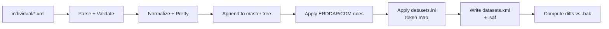

### External ERDDAP Join Scripts: Analysis and Reimplementation Notes

This document analyzes the external orchestration used outside GDP to assemble ERDDAP’s master `datasets.xml` from many
per‑dataset XML files generated by GDP. It explains what each script does, why, and how you could reimplement the same
behavior in Python (or a more robust tool) as part of a revamp.

---

### Context: Why These Scripts Exist

- GDP emits individual dataset XML files (one per mission/platform/mode) into an “individual configs” directory.
- ERDDAP requires a single `datasets.xml` that concatenates all dataset `<dataset>` entries and global options.
- The external `join_datasets.sh` stitches together:
    - A header template (`start.xml`)
    - All individual dataset XMLs (after validation/formatting)
    - A footer template (`end.xml`)
    - Then applies some corrective/insertion rules, token substitutions, and produces `datasets.xml`.
- Rundeck job triggers the join to refresh ERDDAP’s master config periodically or after new individual XMLs are
  generated.

---

### Runner (Rundeck) Snippet

```
echo "===== Regenerate datasets.xml ====="
TEMPLATES="<server_home_user>/docker-erddap/dataset_configs/templates"
CONFIGS="<server_home_user>/docker-erddap/dataset_configs/individual"
OUT_DIR="<server_home_user>/docker-erddap/content"
echo "Running join_datasets.sh"
<server_home_user>/docker-erddap/tools/join_datasets.sh "$CONFIGS" "$TEMPLATES" "$OUT_DIR"
```

- Inputs
    - `CONFIGS`: folder of individual per‑dataset XMLs (GDP output)
    - `TEMPLATES`: folder containing `start.xml` and `end.xml`
    - `OUT_DIR`: target location where `datasets.xml` is written (and backup exists)

---

### join_datasets.sh — What It Does, Step by Step

Inputs: `datasets_dir`, `templates_dir`, `output_dir`

1. Argument validation
    - If any of the three parameters are missing, print usage.

2. Prepare variables
    - `DATASETS_DIR=$1`
    - `TEMPLATES_DIR=$2`
    - `OUTPUT_DIR=$3`
    - `TOOLS='/home/otn/docker-erddap/tools'` (used later for token substitutions via `datasets.ini`)

3. Back up existing output
    - If `$OUTPUT_DIR/datasets.xml` exists, move it to `$OUTPUT_DIR/datasets.xml.bak`.

4. Start a new build file
    - Initialize a staging output: `$OUTPUT_DIR/datasets.xml.saf` (a safe working copy)
    - Write the header template into it: `cat $TEMPLATES_DIR/start.xml > $OUTPUT_DIR/datasets.xml.saf`

5. Append individual dataset XMLs
    - Iterate all `*.xml` files in `$DATASETS_DIR`:
        - Special case: `0users.xml` is appended as‑is (without re‑formatting). This likely contains `<users>` block or
          admin datasets that must appear first.
        - For every other file `f`:
            - Validate well‑formed XML: `xmllint -noout $f`
            - If valid: pretty‑print and strip XML prolog (`<?xml version=...?>`) using
              `xmllint --format $f | grep -v "xml version="` and append to the staging output.
            - If invalid: log the filename to `$OUTPUT_DIR/skipped_xml.log` and set a `bad_found=true` marker.

6. Finish the file with footer

- Append `end.xml` to close the root elements: `cat $TEMPLATES_DIR/end.xml >> $OUTPUT_DIR/datasets.xml.saf`.

7. Global search‑and‑replace hotfixes

    - Apply a series of sed‑based corrections to ensure CF/ERDDAP compliance:
        - Insert `sampling_day` into `cdm_timeseries_variables` list (timeseries datasets):
        - Use
          `sed -i 's/<att name="cdm_timeseries_variables">latitude, longitude/<att name="cdm_timeseries_variables">sampling_day, latitude, longitude/g' ...`
        - Insert `trajectory_id` semantics into TrajectoryProfile datasets and enforce `cf_role=trajectory_id` on
          variable
          `trajectory` with a multi‑line `sed -i -z` rule.
        - Note: These are temporary “repair” patches to accommodate inconsistent historical datasets until all are
          reprocessed.

8. Token substitution via datasets.ini

    - Copy the `.saf` file to the canonical `datasets.xml`:
        - `cp $OUTPUT_DIR/datasets.xml.saf $OUTPUT_DIR/datasets.xml`
    - For each line `lhs rhs` in `$TOOLS/datasets.ini`, perform `sed -i "s/$lhs/$rhs/g"` on `datasets.xml`:
        - Purpose: Replace placeholders (tokens, path markers, or legacy strings) with deployment‑specific text.
        - Side‑effects: This can also be used for bulk renaming or hotfixing attribute values.

9. Diff against a previous version

    - `diff $OUTPUT_DIR/datasets.xml $OUTPUT_DIR/datasets.xml.bak > $OUTPUT_DIR/diffs.log`
    - Purpose: Operators can review changes and look for suspicious diffs; useful when templates/content evolve.

10. Operator guidance (manual tasks)
    - A long echoed note instructs ops to:
        - Inspect diffs
        - Enter the ERDDAP container and run `GenerateDatasetsXml.sh`, selecting `addFillValueAttributes` to have ERDDAP
          add
          missing `_FillValue` attributes; specify the correct container paths.
        - Re‑run diffs afterwards and remove duplicate rows if needed (with `cat -n datasets.xml | uniq -d -f1`).

11. Exit status
    - If `bad_found=true` (invalid XML detected), exit `1`; else exit `0`.

---

### Why certain hacks exist (temporary fixes)

- The `sed` rules that patch `cdm_timeseries_variables` and inject `cf_role=trajectory_id` indicate a gap between the
  generated individual XMLs and ERDDAP’s enforced CDM conventions. They keep publication unblocked while the upstream
  generation (GDP’s ERDDAP config factories) catches up or historical datasets are reprocessed.
- `xmllint` gating ensures only well‑formed XML enters the master file, preventing ERDDAP parse failures on boot.
- `datasets.ini` substitutions decouple static scripts from environment‑specific string changes; however, they can mask
  drift if used as a catch‑all patch layer.

---

### Reimplementation in Python: Proposed Design

Goals:

- Deterministic, testable assembly of `datasets.xml` with structured logging and clear error reporting
- Remove shell‑specific pitfalls (quoting, locale, grep/sed portability)
- Integrate schema validation (optionally XSD) and configurable lint rules instead of ad‑hoc `sed` fixes
- Provide a dry‑run mode and diffs with rich context

Suggested stack:

- XML parsing/formatting: `lxml` (or `xml.etree.ElementTree` with pretty printing; `lxml` preferred for robust XPath)
- Validation: `xmllint` compatibility or built‑in XSD with `lxml`
- Diff: unified diff with `difflib` or `git diff` style output
- CLI: `typer`/`click`

High‑level algorithm in Python:

1. Load `start.xml` and `end.xml` as ElementTrees or as raw text wrappers.
2. Enumerate all individual `*.xml` in `datasets_dir`; sort deterministically; insert `0users.xml` first if present.
3. For each file:
    - Parse and validate (well‑formedness + optional schema rules).
    - Strip XML declaration if present.
    - Optionally normalize indentation/attributes.
    - Append its `<dataset>` (or relevant nodes) into the main in‑memory tree.
4. Apply normalization rules programmatically:
    - Ensure `cdm_timeseries_variables` includes required ids depending on `cdm_data_type`.
    - If `trajectory` exists, set `cf_role=trajectory_id` and ensure it’s included in `cdm_trajectory_variables`.
    - Prefer targeted XPath edits (e.g., only for datasets with `cdm_data_type=TrajectoryProfile`).
      5.Token substitutions:
    - Read `datasets.ini` as `lhs rhs` pairs (allow quoting); apply to specific attributes via XPath rather than global
      regex when possible.
    - If global text replace is still needed (e.g., path roots), document exact scope and escape regex metacharacters
      safely.
6. Write to `datasets.xml.saf` and then atomically to `datasets.xml` (use `tempfile` + `os.replace`).
7. Compute and write diffs to `diffs.log` (optionally only for changed sections).
8. Exit non‑zero if any invalid XMLs were encountered (collect a list and write `skipped_xml.log`).

Optional improvements:

- Add a `--fix` mode that suggests what GDP’s ERDDAP XML generator should change (i.e., move the `sed` patches back into
  generation/refinement factories to eliminate post‑join hacks over time).
- Add unit tests that feed minimal `start.xml`, `end.xml`, and a handful of individual XMLs, asserting the final master
  file’s correctness.

#### Proposed Python Joiner Architecture



---

### Integration with GDP and ERDDAP

- Input location (`individual/`) corresponds to where GDP writes refined per‑dataset XML files.
- Templates directory (`templates/`) holds `start.xml`/`end.xml`; these are static and could live in repo.
- Output directory (`content/`) is ERDDAP’s content directory (often bind‑mounted at `/usr/local/tomcat/content/erddap/`
  in the container).
- Post‑join tasks (GenerateDatasetsXml.sh with addFillValueAttributes) are a separate ERDDAP tooling step; consider:
    - Automating this via ERDDAP’s command line in a safe staging workspace
    - Or avoiding it by ensuring GDP emits all required `_FillValue` attributes upfront (preferred)

---

### Risk & Reliability Notes

- Regex replacements (`sed`) can unintentionally modify unrelated nodes; XPath‑targeted edits are safer.
- XML pretty‑printing differences can cause noisy diffs; normalize consistently (attribute order, indentation).
- Ensure proper error aggregation and non‑zero exit codes to fail Rundeck jobs early on invalid input.
- Backups and diffing are useful; keep a retention policy for `datasets.xml.bak` and `diffs.log`.

---

### Migration Checklist (Shell → Python)

- Implement Python joiner with CLI parity:
  `join_datasets.py DATASETS_DIR TEMPLATES_DIR OUTPUT_DIR --tokens datasets.ini`
- Add unit tests with broken XML (should land in `skipped_xml.log` and non‑zero exit)
- Codify current `sed` patches as explicit, dataset‑type‑specific transformations; add tests
- Dry‑run on staging, compare diffs to current shell output
- Switch Rundeck to call the Python script; keep shell as fallback until confidence is high
- Long‑term: eliminate post‑join patches by fixing GDP’s ERDDAP XML refiner to emit correct `cdm_*` and `cf_role`
  attributes

---

### Appendix: Mapping Shell Behavior to Python

- Validate XML: `lxml.etree.XMLParser(recover=False)` + try/except → mirrors `xmllint -noout`
- Pretty print: `lxml.etree.tostring(elem, pretty_print=True, xml_declaration=False, encoding='unicode')`
- Strip XML prolog: set `xml_declaration=False`
- Global substitutions: implement as token map; for path roots use targeted XPath if possible
- Diff: `difflib.unified_diff(old.splitlines(), new.splitlines(), fromfile='datasets.xml.bak', tofile='datasets.xml')`

With this plan, we preserve current operational semantics while gaining stronger validation, testability, and a pathway
to retire the ad‑hoc fixes by moving correctness upstream into GDP’s XML generation layer.