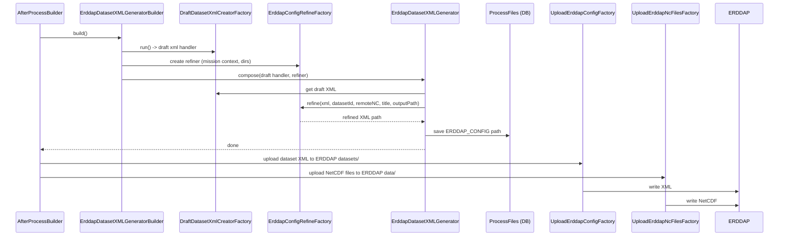
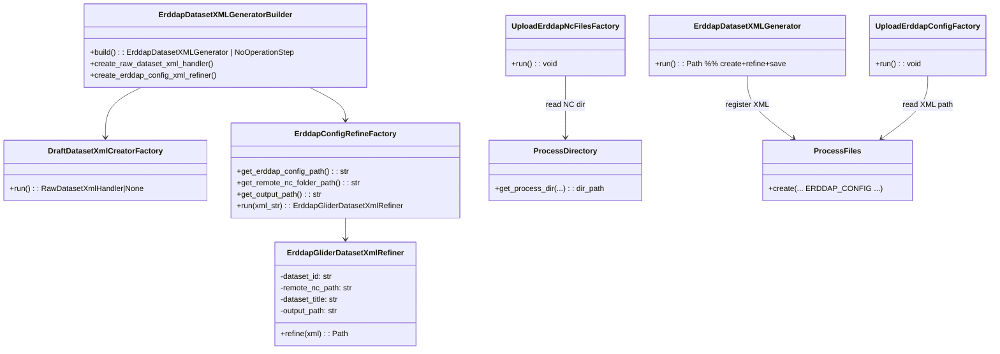

### ERDDAP Layer in GDP — Detailed, End‑to‑End Guide

This document explains how the ERDDAP layer works in the Glider Data Pipeline (GDP): how individual dataset XML files
are generated and refined, how they relate to NetCDF outputs and metadata, what classes and factories are involved, how
uploads happen, and how to configure/customize the flow.

---

### Big Picture

GDP produces NetCDF files for each mission (real‑time or delayed) and then generates a matching ERDDAP dataset XML that
describes how ERDDAP should serve those NetCDFs. The ERDDAP layer consists of:

- Draft XML creation (from actual files + templates or helper tools)
- XML refinement (inject datasetId, global metadata, target NetCDF directory, etc.)
- Upload of dataset XML into the ERDDAP config directory
- Upload of NetCDF products into ERDDAP’s data directory
- Optional backup and post‑processing housekeeping/notifications

---

### Key Files and Classes

- Builder/Orchestrator (post‑processing stage):
    - `gdp/contrib/step_implementation/errdap_dataset_config/factory/errdap_dataset_xml_generator_builder.py`
        - Class: `ErddapDatasetXMLGeneratorBuilder`
        - Wires draft XML creator + config refiner into a runnable generator step
- Draft XML creation:
    - `gdp/contrib/step_implementation/errdap_dataset_config/factory/draft_xml_creation.py` (referenced by the builder)
    - Tests/resources for invoking a helper script:
      `tests/erddap_dataset_command_generate/resource/GenerateDatasetsXml.sh`
- Config refinement:
    - `gdp/contrib/step_implementation/errdap_dataset_config/factory/errdap_config_refine.py`
        - Class: `ErddapConfigRefineFactory` → produces `ErddapGliderDatasetXmlRefiner`
    - `gdp/contrib/step_implementation/errdap_dataset_config/erddap_dataset_xml_refiner.py`
        - Class: `ErddapGliderDatasetXmlRefiner` (applies dataset‑specific context)
- High‑level generator (the product step):
    - `gdp/contrib/step_implementation/errdap_dataset_config/errdap_config.py`
        - Class: `ErddapDatasetXMLGenerator` (combines draft + refine and saves output)
- Upload to ERDDAP (data + XML):
    - `gdp/contrib/step_implementation/errdap_data_file_upload/*` (factories, uploader)
- Post‑processing registration/orchestration:
    - `gdp/contrib/step_handlers/after_process_step_handlers.py`
- Persistence and directory resolution:
    - `gdp/models.py` → `ProcessFiles`, `ProcessDirectory`
    - `gdp/settings.py` → `FILE_TYPE`, `DIRECTORY_TYPE`, `ERDDAP_CONFIG`, `MISSION_TYPE`

---

### ERDDAP XML Generation Flow

1) Entry via post‑processing builder
    - `AfterProcessBuilder` includes a handler `CreateErddapConfigStepHandler` which uses
      `ErddapDatasetXMLGeneratorBuilder` to construct the generator step.

2) Draft XML creation (raw handler)
    - `ErddapDatasetXMLGeneratorBuilder.create_raw_dataset_xml_handler()`
    - Calls `DraftDatasetXmlCreatorFactory(...).run()` to produce a `RawDatasetXmlHandler` that can build a draft
      datasets XML snippet or file. This may:
        - Inspect the mission’s NetCDF outputs (in `DIRECTORY_TYPE["netcdf_path"]`)
        - Optionally invoke helper tooling/scripts (see test resource `GenerateDatasetsXml.sh`)
        - Yield a draft XML string (or an object that provides it)

3) Config refinement
    - `ErddapDatasetXMLGeneratorBuilder.create_erddap_config_xml_refiner()` returns `ErddapConfigRefineFactory`, which:
        - Reads mission context from `mission_dict`: `platform_name`, `deployment_number`, `start_time`, `end_time`
        - Resolves output directory from DB via
          `ProcessDirectory.get_process_dir(mission_type, deployment_number, DIRECTORY_TYPE["erddap_config_path"])`
        - Determines where ERDDAP will look for NetCDF: builds a remote NC folder path under
          `settings.ERDDAP_CONFIG["ERDDAP_DOCKER_CONTAINER_NC_TARGET_DIR"]`
            - Uses `FILE_TYPE["NC_RT"]` for real‑time or `FILE_TYPE["NC"]` for delayed
            - Path pattern:
              `<ERDDAP_DOCKER_CONTAINER_NC_TARGET_DIR>/<platform_name_lower>/<start_time_short>/<NC or NC_RT>`
        - Computes an output XML file path: `<erddap_config_path>/<platform>_<start_short>_<mission_type>.xml`
        - Instantiates `ErddapGliderDatasetXmlRefiner(xml, dataset_id, remote_nc_path, title, output_path)`

4) Combine draft + refine
    - `ErddapDatasetXMLGenerator` runs the draft handler to get XML, passes it to the refiner, applies
      substitutions/enrichments, then writes the final XML to the output path.

5) Register the created XML
    - The XML file path is stored in `ProcessFiles` with `FILE_TYPE["ERDDAP_CONFIG"]`, so later steps (e.g., upload) can
      locate it.

6) Upload to ERDDAP
    - `UploadErddapConfigStepHandler` uses `UploadErddapConfigFactory` to copy/sync the XML to ERDDAP’s datasets
      directory.
    - `UploadNcFileStepHandler` uses `UploadErddapNcFilesFactory` to copy/sync the NetCDFs to ERDDAP’s data directory.

7) Optional backup and notifications
    - `BackupErddapNcFolderStepHandler` backs up the NC directory before a refresh (recommended for delayed
      authoritative runs).
    - `SlackNotificationHandler` announces results to operations.

#### Mermaid: ERDDAP XML Generation + Upload (Sequence)

---

### Class & Responsibility Map

---

### How Dataset IDs, Titles, and Paths Are Determined

- Dataset ID
    - Derived by `BaseBuilder`/refiner helpers (e.g., `<platform>_<start_time_short>_<mission_type>`). This creates a
      stable, unique identifier per mission + mode.
- Dataset Title
    - Built from mission context (platform name, date window, mode) to produce a human‑readable title for ERDDAP UI.
- NetCDF Target Directory (as visible to ERDDAP)
    - Constructed under `settings.ERDDAP_CONFIG["ERDDAP_DOCKER_CONTAINER_NC_TARGET_DIR"]` (e.g., a bind‑mount path in
      the ERDDAP container):
        - `/<root>/<platform_lower>/<start_time_short>/<NC or NC_RT>`
    - The NC vs NC_RT subfolder is determined by mission type: delayed = `NC`, real‑time = `NC_RT`.
- XML Output Location
    - Local XML is written under the mission’s ERDDAP config output directory from `ProcessDirectory` with
      `DIRECTORY_TYPE["erddap_config_path"]`.

---

### Draft vs. Refined XML

- Draft XML
    - Minimal, auto‑derived structure created from available files and templates/scripts
    - Focuses on listing variables and basic dimensions inferred from NetCDF outputs
- Refined XML (final)
    - Injects canonical `datasetID`, `title`, and all global attributes expected by ERDDAP
    - Sets `<dataset>` `fileDir`/`ncSource` (or equivalent) to the computed remote NC directory path that ERDDAP sees
    - Applies variable attribute refinements (standard_name, units, long_name, axis roles), harmonizing with metadata
      JSON

This two‑stage approach separates “discovery” of structure from “policy” of deployment and naming, making it easier to
evolve either layer.

---

### Where Metadata Fits

- Metadata JSON (from `meta_generation`) supplies canonical variable semantics (names, units, standard names, global
  attrs)
- The XML refiner reads or is provided with the same canonical view to ensure ERDDAP XML matches the NetCDF file
  contents and conventions
- Consistency between NetCDF writer and ERDDAP XML refiner avoids drift and ensures CF/ERDDAP conformity

---

### Uploads and Backups

- XML Upload (`UploadErddapConfigFactory`)
    - Copies refined dataset XML into the ERDDAP datasets directory on the target host/container
    - Optionally triggers an ERDDAP reload depending on deployment
- NetCDF Upload (`UploadErddapNcFilesFactory`)
    - Copies mission’s NetCDF files into the ERDDAP data directory corresponding to the computed `remote_nc_path`
- Backup (`BackupErddapNcFilesFactory`)
    - Creates a timestamped backup of the ERDDAP NC directory; supports rotation policies

---

### Persistence and Idempotency

- `ProcessFiles` records the path to the final XML (`FILE_TYPE["ERDDAP_CONFIG"]`) and may track NetCDF outputs
- `ProcessDirectory` stores mission directories used to locate NetCDF and ERDDAP config output
- Builder returns `NoOperationStep` if prerequisites aren’t met (e.g., no NetCDF files → skip XML generation)
- Re‑runs overwrite XML deterministically or skip if unchanged; backups avoid data loss on re‑publishing

---

### Configuration Surface

- `settings.ERDDAP_CONFIG` (not exhaustive):
    - `ERDDAP_DOCKER_CONTAINER_NC_TARGET_DIR` — container‑visible data root for NetCDF products
    - Other host/dir settings used by upload factories (target datasets dir, data dir)
- `settings.FILE_TYPE` — maps labels like `NC`, `NC_RT`, `ERDDAP_CONFIG`
- `settings.DIRECTORY_TYPE` — maps roles like `netcdf_path`, `erddap_config_path`
- CLI flags (affecting whether steps run):
    - `-c/--config_erddap` — enables XML generation
    - `--upload` — enables upload of both dataset XML and NetCDF data

---

### Troubleshooting Tips

- XML generated but ERDDAP doesn’t show dataset:
    - Verify XML copied to correct ERDDAP datasets/ directory; check ERDDAP logs for parsing errors
    - Confirm `datasetID` uniqueness; ensure NetCDF directory path in XML matches ERDDAP’s container‑visible path
- Dataset shows but no data/variables:
    - Check that NetCDF files were uploaded to the directory referenced by the XML
    - Validate that variables and dimensions in NetCDF match what the XML expects
- Permission/path issues:
    - Ensure ERDDAP container has read permissions to data path (bind mounts, UID/GID alignment)

---

### Summary

The ERDDAP layer in GDP is a modular post‑processing pipeline that:

- Creates a draft datasets XML based on produced NetCDFs
- Refines and finalizes XML with mission context, dataset IDs, and ERDDAP‑visible paths
- Registers the XML in the database for traceability
- Uploads both XML and NetCDF to ERDDAP, with optional backups and notifications

