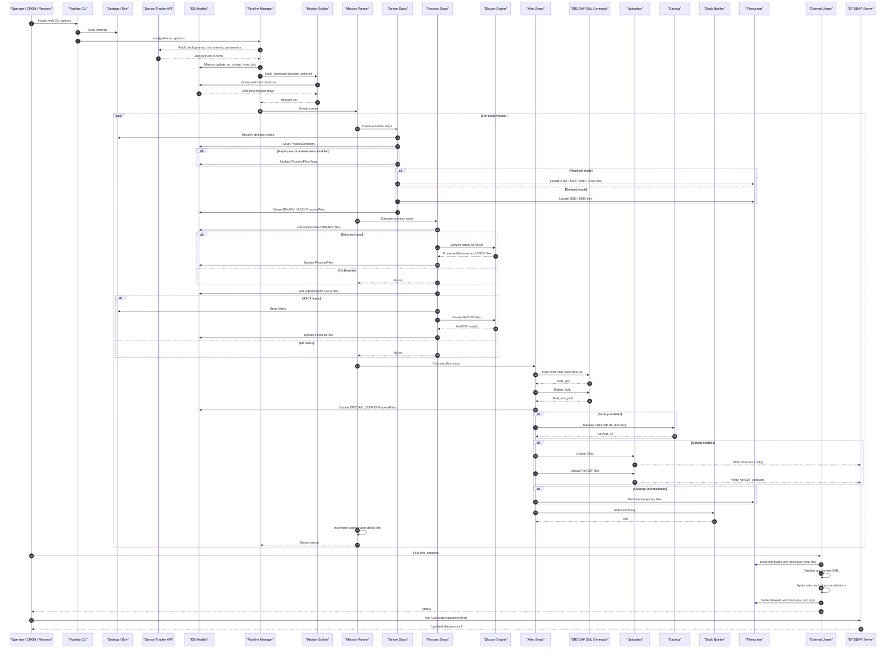

### End‑to‑End GDP Processing — Master Sequential Diagram (Implementation‑Agnostic)

This master sequence is a canonical reference for maintainers re‑implementing the pipeline while preserving or
referencing behaviours. It spans: mission sync/selection, pre‑processing, core processing (binary→ASCII→NetCDF),
post‑processing (ERDDAP XML + uploads), and external master `datasets.xml` assembly. It abstracts away specific
libraries (GUTILS, pyglider, etc.) and focuses on responsibilities, inputs/outputs, and coordination.

---

### Notes & Contracts (for Re‑implementation)

- Inputs/Outputs
    - All file paths must be resolved via a directory role abstraction (e.g., `ProcessDirectory`), not hardcoded
      strings.
    - All artifact paths (raw, ASCII, NC, XML, META_JSON) are recorded in a file catalog (e.g., `ProcessFiles`) to
      ensure idempotence.

- Modes & Selection
    - Real‑time processes current mission (no `end_time`), delayed processes completed missions; explicit lists
      override.
    - Auto‑delayed runner should support a `PROCESS_LIMIT` to bound batch runs.

- Engine Interchangeability
    - Engine API must expose: `convert_bin_to_ascii(...)` and `create_netcdf(...)` equivalents that accept filters, meta
      dir, and time bounds.
    - Return structures must include success/failure lists for accurate DB updates and logs.

- ERDDAP XML
    - Two‑stage generation (draft + refine) or an equivalent single stage that guarantees: datasetID, title,
      ERDDAP-visible NC dir, and correct variable/global attributes.

- External Joiner
    - Validates individual XML, assembles master, applies minimal rules/patches; aim to migrate those rules upstream
      into XML generation.

- Observability
    - Structured logs per stage; summaries per mission; explicit lists of skipped/failed files; diffs for master
      `datasets.xml`.

- Failure Policy
    - Steps are individually fault‑tolerant (continue over per‑file errors), with final aggregation and non‑zero exit on
      fatal conditions.

This diagram and notes are meant as the definitive behavioural contract irrespective of internal libraries.
Re‑implementations should preserve sequence boundaries, side‑effects, and observable outputs to remain fully compatible
with existing operations and ERDDAP publication workflows.