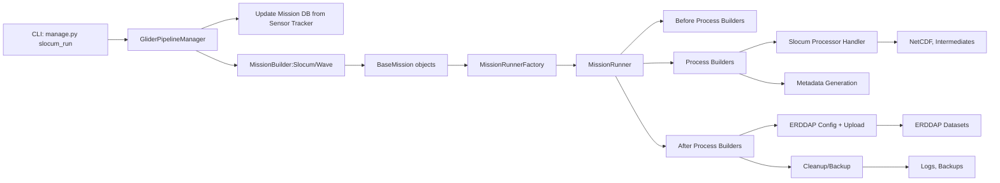
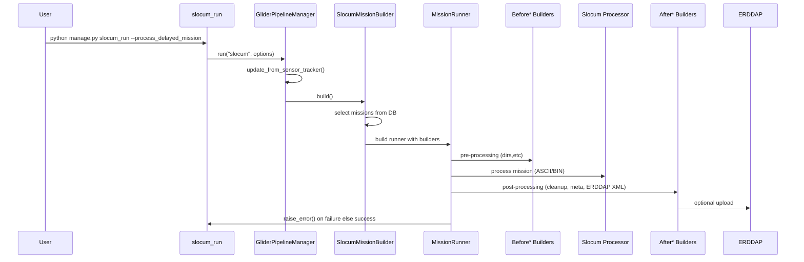
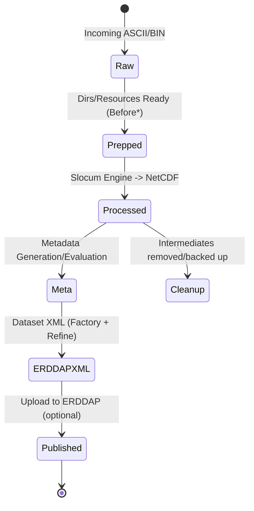

### Glider Data Pipeline (GDP) — Comprehensive Overview

This document provides a high‑level and practical overview of the Glider Data Pipeline (GDP) from command entry to data
products and ERDDAP publication. It is written for GitHub Pages and includes Mermaid diagrams you can render on your
site.

---

### What the Pipeline Does

GDP is a Django‑based, command‑line pipeline that:

- Discovers and selects Slocum (and Wave) missions from a database synchronized with a Sensor Tracker.
- Builds a mission‑specific process plan using modular step builders.
- Executes pre‑processing (e.g., directory setup), core processing (e.g., Slocum ASCII/BIN processing), and
  post‑processing (e.g., cleanup, ERDDAP config generation and upload).
- Produces validated NetCDF datasets, metadata artifacts, and ERDDAP dataset configurations.
- Supports real‑time and delayed modes, selective reprocessing, and Slack notifications.

Core entrypoint example:

```
python manage.py slocum_run --process_delayed_mission
python manage.py slocum_run -ml 136 -a --delayed
```

---

### Key Features

- Mission orchestration driven by database records and CLI options
- Two modes for Slocum: real‑time (`--live`/`--process_realtime_mission`) and delayed (`--delayed`/
  `--process_delayed_mission`)
- Modular process builders: Before, Process, After
- ERDDAP XML generation and upload
- Metadata generation with strict/lenient validation options
- Reprocessing support and fine‑grained mission selection
- File housekeeping and backup helpers
- Structured logging with summary and error propagation

---

### Architectural Overview

- Entry Commands: `gdp/management/commands/slocum_run.py`
- Pipeline Orchestration: `gdp/core/pipeline/manager.py`, `gdp/core/pipeline/runners.py`
- Mission Selection & Assembly: `gdp/core/mission/factory.py`, `gdp/core/mission/mission.py`
- Step Builders: `gdp/core/process/*`
- Components/Factories: `gdp/component/*`
- Contrib Step Implementations: `gdp/contrib/step_implementation/*`
- Engines (algorithms and adapters): `gdp/engine/slocum/*`, `gdp/engine/wave/*`

#### Mermaid: High‑Level System Architecture



---

### End‑to‑End Execution Flow

1. slocum_run command
    - Parses CLI options: mission list/range, real‑time vs delayed, ASCII/BIN, ERDDAP, upload, meta, filters, reprocess,
      etc. (`gdp/management/commands/slocum_run.py`)
    - Sets platform `slocum` and invokes `GliderPipelineManager("slocum", options).run()`

2. Pipeline bootstrap (`gdp/core/pipeline/manager.py`)
    - Syncs local Mission table from Sensor Tracker via `gdp.component.stp.get_glider_deployment()` and
      `Mission.update_or_create_from_dict(...)`
    - Resolves a mission builder based on glider type
    - Gets selected missions from DB according to options (real‑time current, latest delayed, or explicit list)
    - Creates a MissionRunner for these missions and executes it

3. Mission selection & assembly (`gdp/core/mission/factory.py`)
    - `BaseMissionBuilder` validates selected missions are present in DB
    - Builds `BaseMission` instances, each with:
        - A `command` object from `gdp.component.CommandFactory`
        - A list of process builders: `BeforeSlocumProcessBuilder`, `SlocumProcessBuilder`, `AfterProcessBuilder` (for
          Slocum)

4. Mission running (`gdp/core/pipeline/runners.py`)
    - Formats mission info for logs
    - Iterates missions in the requested order (e.g., latest first for delayed processing)
    - Executes each builder chain and collects errors; raises on failure at the end

5. Step builders and contrib implementations
    - Before steps:
        - Local directory creation and validation: `gdp/contrib/step_implementation/local_directories_creation/*`
    - Process steps:
        - Slocum processing handler:
          `gdp/contrib/step_implementation/slocum_processor_handler/slocum_processor_handler.py`
        - Wave processing path (when applicable): `gdp/engine/wave/engine/*`
    - After steps:
        - File cleanup: `gdp/contrib/step_implementation/file_clean/file_cleaning.py`
        - ERDDAP dataset XML generation: `gdp/contrib/step_implementation/errdap_dataset_config/*`
        - ERDDAP upload: `gdp/contrib/step_implementation/errdap_data_file_upload/*`
        - Optional backup of ERDDAP files: `gdp/contrib/step_implementation/backup_erddap_files/*`

#### Mermaid: Sequence of a Typical Slocum Delayed Run



---

### Major Components and Responsibilities

- Management Commands
    - `slocum_run.py`: Parses options, initializes pipeline, controls mission selection mode, timing, and overall run
      reporting.

- Pipeline Manager (`gdp/core/pipeline/manager.py`)
    - Sensor Tracker sync to Mission table
    - Mission discovery and validation
    - Runner creation and execution; global error handling and logging

- Mission Builders (`gdp/core/mission/factory.py`)
    - `SlocumMissionBuilder`, `WaveMissionBuilder`: Choose process builders per platform
    - `get_selected_mission_list()`: Real‑time/delayed/list logic; DB queries

- Runners (`gdp/core/pipeline/runners.py`)
    - Encapsulate flow strategy (e.g., auto‑delayed mode) and summary/error reporting

- Step Builders (`gdp/core/process/*`)
    - `BeforeSlocumProcessBuilder`, `SlocumProcessBuilder`, `AfterProcessBuilder`
    - Compose step handlers from `gdp/contrib/step_handlers/*`

- Contrib Steps (`gdp/contrib/step_implementation/*`)
    - Local directories creation: ensure expected input/output/working dirs exist
    - Slocum processor handler: orchestrates conversion and QC of Slocum flight data to NetCDF
    - ERDDAP dataset config: generate XML via factory and refine passes; resources and templates in `.../factory` and
      `.../tests/.../resource`
    - ERDDAP upload: copy/sync products to target ERDDAP data directory
    - File cleanup/backup: remove intermediates unless `--keep_middle_process_files`; backup prior ERDDAP files if
      configured
    - Metadata generation: `gdp/contrib/step_implementation/meta/...` with templates for slocum and wave

- Engines
    - Slocum: algorithmic/adapter code in `gdp/engine/slocum/engine/...` (including `ceotr_gutils`, `ceotr_pocean`)
    - Wave: sources and process in `gdp/engine/wave/engine/...`

- Components (`gdp/component/*`)
    - Command factory and command list creation from CLI options
    - File, NC utilities, parsers, and shared helpers

---

### Inputs, Outputs, and Directories

- Inputs
    - Raw flight logs and associated ASCII/BIN files for Slocum missions
    - Mission definitions from Sensor Tracker synchronized into the `Mission` model
    - Resource/templates for ERDDAP XML and metadata generation

- Outputs
    - NetCDF files (delayed/high‑res or real‑time/low‑res)
    - Metadata files (templated)
    - ERDDAP dataset XML configurations
    - Uploaded datasets into ERDDAP data directory (if `--upload`)
    - Logs and optional backups; intermediate processing artifacts (kept or cleaned)

- Typical directories (varies by deployment)
    - Source/resource directory: `-R/--resource_dir`
    - Output directory: `-O/--output_dir`
    - ERDDAP dataset XML/output locations per local configuration
    - Tests and example resources are under `gdp/contrib/step_implementation/.../tests/**/resource`

---

### Slocum Modes and Selection

- Real‑time (current mission): `--process_realtime_mission` or `--live`
    - Selects the mission with `end_time=None`
- Delayed (most recent unprocessed): `--process_delayed_mission` or `--delayed`
    - Orders by `deployment_number` desc and processes accordingly
- Explicit selection
    - `-ml/--mission_list` for specific deployments
    - `-m/--missions` for single or range; helper builds a list

---

### ERDDAP Configuration and Upload

- XML generation pipeline builds initial dataset configs and refines them using resources and templates in contrib
  factories
- Optional `--upload` pushes NetCDF outputs to ERDDAP data directory; XML deployment is handled by config steps
- Backup of existing datasets can be enabled via backup steps to ensure safe updates

---

### Metadata Generation & Validation

- Metadata templates under `gdp/contrib/step_implementation/meta/meta_generation/templates/{slocum|wave}`
- CLI options allow strictness control: `--no_strict` (lenient) and `--evaluate_nc_file`
- Metadata can be generated with `--meta` or baked into post‑processing steps depending on command composition

---

### Logging, Errors, and Notifications

- Structured logging across pipeline managers, builders, and runners
- `MissionRunner.raise_error()` aggregates failures and exits the command with non‑zero when needed
- Optional Slack notifications via `--slack_notification` step handler
- Execution time summary automatically logged by `slocum_run`

---

### CLI Options Summary (Slocum)

Commonly used:

1. `--process_realtime_mission` or `--live`
2. `--process_delayed_mission` or `--delayed`
3. `-ml/--mission_list`, `-m/--missions [l r]`
4. `-a/--asciiProcess`, `-b/--binProcess`
5. `-c/--config_erddap`, `--upload`
6. `--reprocess`, `--keep_middle_process_files`
7. `--meta`, `--evaluate_nc_file`, `--no_strict`
8. Filters: `--tsint`, `--filter_distance`, `--filter_points`, `--filter_time`, `--filter_z`
9. UX/ops: `--hide_process_bar`, `--test_run`, `--slack_notification`

---

### Extending the Pipeline

- Add a new step
    - Implement in `gdp/contrib/step_implementation/<your_step>/...`
    - Expose a factory or handler compatible with existing step handler interfaces
    - Register in appropriate builder (`Before*`, `Process*`, `After*`) via the step handler lists

- Add a new mission type
    - Create a `*MissionBuilder` with `GLIDER_TYPE` and override `process_builder_list()`
    - Implement an engine under `gdp/engine/<type>/engine/...`
    - Extend `GliderPipelineManager.BUILDER_CLASS` if needed

- Customize ERDDAP XML
    - Update templates and refine passes in `.../errdap_dataset_config/factory`
    - Add tests/resources alongside `.../tests/**`

---

### Developer Pointers (Selected Files)

- Command entry: `gdp/management/commands/slocum_run.py`
- Pipeline manager: `gdp/core/pipeline/manager.py`
- Runners: `gdp/core/pipeline/runners.py`
- Mission builders: `gdp/core/mission/factory.py`
- Before/Process/After builders: `gdp/core/process/*`
- Slocum handler: `gdp/contrib/step_implementation/slocum_processor_handler/slocum_processor_handler.py`
- ERDDAP config & upload: `gdp/contrib/step_implementation/errdap_dataset_config/*`, `.../errdap_data_file_upload/*`
- Metadata: `gdp/contrib/step_implementation/meta/*`

---

### Example: Typical Delayed Mission Command

```
python manage.py slocum_run \
  --process_delayed_mission \
  -a \
  -R /data/glider/resources \
  -O /data/glider/output \
  -c --upload
```

Behavior:

- Select latest Slocum delayed missions
- Process ASCII inputs into NetCDF with filtering parameters
- Generate ERDDAP XML and upload data
- Cleanup intermediates unless `--keep_middle_process_files` is set

---

### Mermaid: Data Products Lifecycle



---

### Notes and Tips

- Use `--test_run` to validate steps without side effects
- Keep `--resource_dir` and `--output_dir` explicit for reproducibility
- For bulk historical processing, prefer `--process_delayed_mission` with an explicit `-ml` list or range
- Ensure ERDDAP server paths and permissions are configured before enabling `--upload`

If you’d like, I can tailor this to your site’s navigation and add links to your exact ERDDAP instance, data
dictionaries, and operational runbooks.