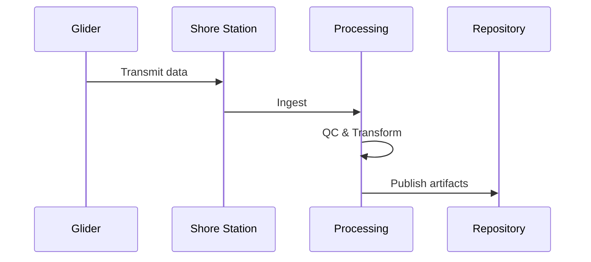

# Glider Data Pipeline

This section outlines the high-level stages of the OTN Glider Data Pipeline.

## Overview

## Stages

1. Ingest: acquire raw data and metadata
2. Process: quality control, calibration, and transformation
3. Publish: expose datasets for consumers and downstream systems
