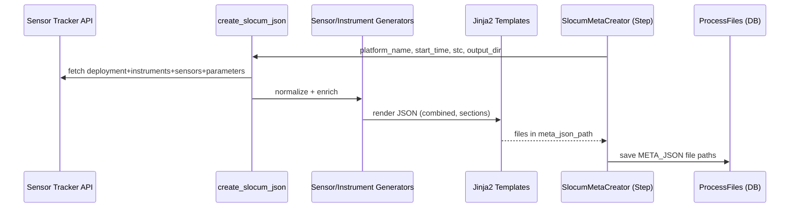
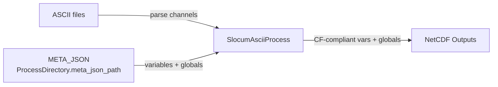
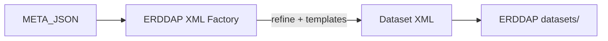
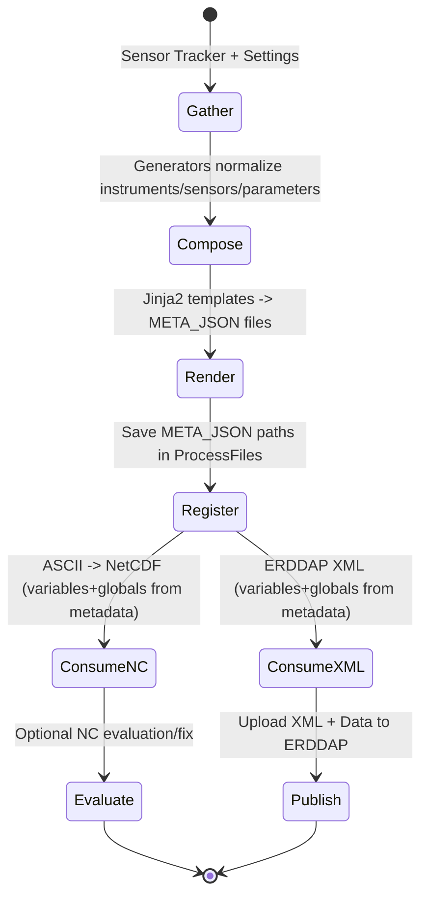

### How Metadata Drives NetCDF Generation in GDP

This document explains how metadata is produced, stored, and consumed throughout the Glider Data Pipeline (GDP) to
generate final NetCDF products and ERDDAP configuration. It covers lineage from Sensor Tracker to templates, the
METADATA JSON artifacts, consumption in processing and XML generation, validation hooks, and practical design choices.

---

### What Counts as “Metadata” in GDP

- Deployment context: platform (glider) name, deployment number, start/end times, testing flag.
- Instrumentation catalog: instruments, sensors, and parameters attached to the platform.
- Variable semantics: CF/ERDDAP conventions (names, units, standard names, long names), global attributes (institution,
  license, source, history).
- Processing configuration: filters (tsint, distance/time/points/z), directory roles, path mappings.

Primary sources:

- Sensor Tracker API (deployments, instruments, sensors, parameters)
- Project templates (Jinja2 in `gdp/contrib/step_implementation/meta/meta_generation/templates/{slocum|wave}`)
- CF Standard Name Table (reference: `cf-standard-name-table.xml`)
- Runtime options (CLI) and settings (`settings.FILE_TYPE`, `settings.DIRECTORY_TYPE`)

---

### Metadata Artifacts and Where They Live

- Type: `META_JSON` files — per‑mission JSON documents containing structured metadata used downstream.
- Saved/Tracked in DB: `ProcessFiles` with `file_type = settings.FILE_TYPE["META_JSON"]`.
- Directory: resolved via `ProcessDirectory.get_process_dir(..., DIRECTORY_TYPE["meta_json_path"])`.
- Produced by: `SlocumMetaCreator` step (a `SavableObjectStep`) in `gdp/core/steps/meta.py`.

---

### Producing Metadata JSON — From Sensor Tracker to Files

Key classes/files:

- `SlocumMetaCreator` (step): orchestrates JSON generation and persistence.
- `create_slocum_json(platform_name, start_time, stc, output_dir_path)` in
  `gdp/contrib/step_implementation/meta/meta_generation/meta_json_generator.py`.
- Generators in `meta_json_generator.py`:
    - `SensorMetaGenerator`: flattens instruments → sensors → parameters (including data‑logger expansions) into unified
      records; normalizes fields (e.g., `instrument_short_name`, `platform`, `observation_type`).
    - `InstrumentMetaGenerator`: produces instrument blocks from Sensor Tracker data.
    - Additional mappings (e.g., `SENSOR_PARAMETER_AND_TEMPLATE_MAPPING`,
      `INSTRUMENT_SENSOR_TRACKER_AND_TEMPLATE_MAPPING`) align Sensor Tracker fields to template expectations.

Flow:

1. `SlocumMetaCreator._run()` calls `create_slocum_json(platform_name, start_time, stc, output_dir_path)`.
2. The generator queries Sensor Tracker (through the provided `stc`/proxy) for platform deployment and instrumentation.
3. It composes two main structures:
    - Sensor/parameter dictionary keyed by identifier.
    - Instrument dictionary keyed by identifier.
4. Jinja2 templates materialize structured JSON files (e.g., `combined_meta.json` plus per‑section JSON) into
   `meta_json_path`.
5. `get_save_data_dict()` returns a payload with all created file paths; `ProcessFilesManager.save_mission_paths`
   persists them with type `META_JSON`.

#### Metadata Generation Lineage

---

### How Metadata Is Used to Build NetCDF

Consumer: `SlocumAsciiProcess` (created by `SlocumAsciiProcessFactory` in
`gdp/contrib/step_implementation/slocum_processor_handler/factory.py`).

- Directory resolution:
    - Reads `meta_json_path` via `ProcessDirectory.get_process_dir(..., DIRECTORY_TYPE["meta_json_path"])`.
    - Reads ASCII inputs and writes NetCDF outputs (`DIRECTORY_TYPE["netcdf_path"])`.
- Variable and attribute mapping:
    - The `META_JSON` describes variables (identifiers, units, standard names, sensor/instrument provenance) and global
      attributes (platform, deployment, institution, source, license).
    - The processor uses these definitions to:
        - Map ASCII channel names to standardized CF variable names.
        - Attach units, `standard_name`, `long_name`, valid ranges, and missing value conventions.
        - Populate global attributes like `title`, `summary`, `keywords`, `Conventions`, `institution`, `source`,
          `history`.
- Filters and decimation parameters from CLI (e.g., `tsint`, `filter_*`) control which observations end up in the
  NetCDF. Metadata provides the semantic layer to ensure resulting variables remain standards‑compliant.

Conceptually:

- Metadata links raw channels to scientific variables with canonical semantics.
- The NetCDF writer reads metadata to create consistent variable definitions and global attributes.
- This ensures ERDDAP ingestion and CF compliance without hand‑coding per‑mission logic.

#### Metadata → NetCDF Mapping

---

### How Metadata Is Used in ERDDAP Dataset XML

- The same canonical metadata shapes drive ERDDAP dataset configuration:
    - Variable `sourceName` ↔ `destinationName` mappings
    - Units, `long_name`, `standard_name`, `ioos_category`, axis roles (e.g., TIME, LATITUDE, LONGITUDE, DEPTH)
    - Global metadata blocks (institution, license, source)
- Factories under `gdp/contrib/step_implementation/errdap_dataset_config/factory/` read produced artifacts and templates
  to generate/refine dataset XML.
- Resulting XML path is saved into `ProcessFiles` with type `ERDDAP_CONFIG` and then uploaded to ERDDAP.

#### Metadata → ERDDAP XML

---

### Validation and Evaluation Hooks

- Option: `--evaluate_nc_file` (see `gdp/core/steps/evaluate_nc_files.py` and factory wiring) evaluates or fixes NetCDF
  outputs after creation.
- Strictness: `--no_strict` can relax certain validations during metadata generation/use.
- Tests and sample resources under `gdp/contrib/step_implementation/errdap_dataset_config/tests/**/resource` help
  validate that metadata → XML mappings remain correct.

---

### Idempotency and Reprocessing

- Metadata generation (`SlocumMetaCreator`) writes to a deterministic `meta_json_path`; re‑runs overwrite or skip based
  on presence.
- `ProcessFiles` records enable steps to decide if metadata needs regeneration.
- Reprocess handlers (`ReprocessMetaStepHandler`) can force regeneration when templates or Sensor Tracker content
  changes.

---

### Why This Design

- Separation of concerns:
    - Sensor Tracker provides authoritative platform/instrument facts.
    - Templates encode project conventions and CF/ERDDAP mapping rules.
    - Steps/factories orchestrate when to generate and how to persist artifacts.
- Reproducibility:
    - Metadata JSON is a durable artifact, recorded in `ProcessFiles` and stored in `meta_json_path` for audits and
      re‑runs.
- Standards compliance:
    - CF and ERDDAP compatibility are achieved by consolidating semantics in METADATA, ensuring consistent outputs
      across missions.
- Operational resilience:
    - Idempotent steps + DB tracking avoid duplicate work and enable safe retries.

---

### Cross‑References (Key Files)

- Producer step: `gdp/core/steps/meta.py :: SlocumMetaCreator`
- Generators and templates: `gdp/contrib/step_implementation/meta/meta_generation/*`
- ASCII→NetCDF consumer: `gdp/contrib/step_implementation/slocum_processor_handler/factory.py` (uses
  `DIRECTORY_TYPE["meta_json_path"]`)
- ERDDAP XML factories: `gdp/contrib/step_implementation/errdap_dataset_config/factory/*`
- DB models: `gdp/models.py` (`ProcessFiles`, `ProcessDirectory`)

---

### End‑to‑End Metadata Life Cycle

