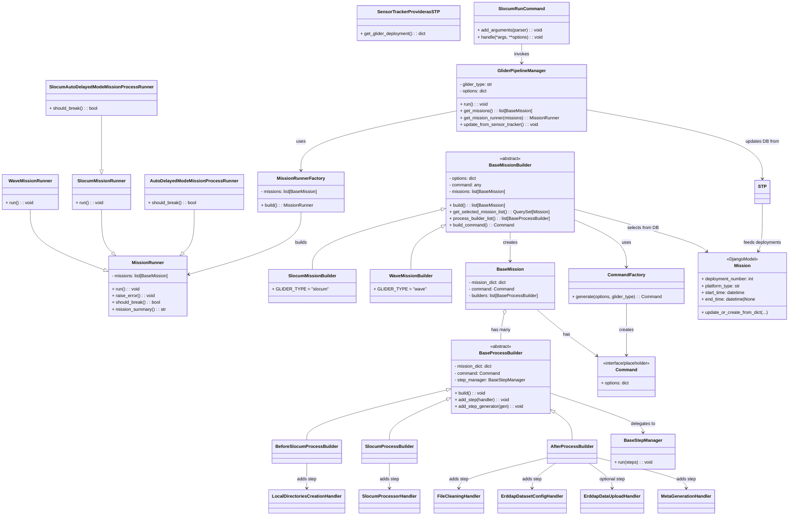

### Class/Object Diagram — Key Relationships

Below is a `classDiagram` capturing the core classes, inheritance, and the most important associations across
the Glider Data Pipeline (GDP). It focuses on orchestration (manager → builders → runners), mission assembly, process
builders, and external integrations (Sensor Tracker → Mission model, ERDDAP steps).

#### Notes

- Class names and relationships reflect the modules observed in `gdp/core` and `gdp/contrib` (e.g.,
  `GliderPipelineManager`, mission builders, runners, process builders, step managers, and representative contrib
  handlers).
- Contrib handlers (e.g., `SlocumProcessorHandler`, `ErddapDatasetConfigHandler`) are shown as step objects added into
  builders via the step manager; the exact handler class names may vary slightly by file, but their roles and
  relationships are consistent.
- The `Mission` model and `SensorTrackerProvider` (via `gdp.component.stp`) illustrate how deployments are synchronized
  before selection.