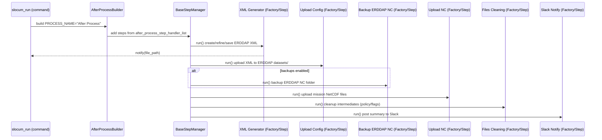

### Post‑Processing in the Glider Data Pipeline (GDP)

This document explains GDP’s post‑processing stage comprehensively: what it does, how classes interact, the step
sequence, configuration surface, error handling, and extension points.

---

### Scope of “Post‑Processing”

Post‑processing runs after core processing (e.g., ASCII → NetCDF) and prepares products for publication and
housekeeping. Typical responsibilities:

- Generate ERDDAP Dataset XML (dataset configuration)
- Upload ERDDAP configuration to the target ERDDAP instance
- Optionally back up the ERDDAP NetCDF folder
- Upload produced NetCDF files to the ERDDAP data directory
- Clean up intermediate or temporary files according to policy
- Send operational notifications (e.g., Slack)

The actual steps are composed by a dedicated builder using a registered list of step handlers.

---

### Key Files and Classes

- Post‑processing builder:
    - `gdp/core/process/after_process_builder.py` → `AfterProcessBuilder`
- Step handler list (post-stage registration):
    - `gdp/contrib/step_handlers/after_process_step_handlers.py`
        - `CreateErddapConfigStepHandler` → `ErddapDatasetXMLGeneratorBuilder`
        - `UploadErddapConfigStepHandler` → `UploadErddapConfigFactory`
        - `BackupErddapNcFolderStepHandler` → `BackupErddapNcFilesFactory`
        - `UploadNcFileStepHandler` → `UploadErddapNcFilesFactory`
        - `FilesCleaningHandler` → `SlocumAfterProcessFilesCleaningFactory`
        - `SlackNotificationHandler` →
          `gdp.contrib.step_implementation.gdp_slack_notification.factory.SlackNotificationFactory`
- ERDDAP dataset config implementation (representative paths):
    - `gdp/contrib/step_implementation/errdap_dataset_config/*` (XML factory, refine passes, tests/resources)
- ERDDAP data upload:
    - `gdp/contrib/step_implementation/errdap_data_file_upload/*`
- Backup and cleanup:
    - `gdp/contrib/step_implementation/backup_erddap_files/*`
    - `gdp/contrib/step_implementation/file_clean/*`
- Shared models/settings involved:
    - `gdp.models.ProcessFiles` and `settings.FILE_TYPE` (to fetch paths like ERDDAP_CONFIG)
    - `gdp.models.ProcessDirectory` and `settings.DIRECTORY_TYPE` (NC output dirs, etc.)

---

### Orchestration in Context

- `AfterProcessBuilder(BaseProcessBuilder)` sets `PROCESS_NAME = "After Process"` and imports
  `after_process_step_handler_list` from `gdp.contrib`.
- The builder iterates the handler list; each handler’s factory returns a concrete Step or a `NoOperationStep` depending
  on conditions (e.g., presence of files, CLI flags), then `BaseStepManager` executes them in order.

Order (default):

1) Create ERDDAP config (XML)
2) Upload ERDDAP config
3) Backup ERDDAP NC folder (optional)
4) Upload NC files to ERDDAP
5) Files cleaning
6) Slack notification

---

### Class/Component Diagram (Post‑Processing)

```mermaid
classDiagram
    class AfterProcessBuilder {
        +get_step_handler_list() list
        +build() BaseStepManager
    }

    class BaseProcessBuilder {
        +add_step_generator()
        +build()
    }

    class BaseStepManager {
        +add_step(step)
        +run()
    }

    AfterProcessBuilder --|> BaseProcessBuilder
    AfterProcessBuilder --> BaseStepManager: produces

    class StepHandler {
        <<abstract>>
        FACTORY_CLASS
    }

    class CreateErddapConfigStepHandler {
        FACTORY_CLASS
    }

    class UploadErddapConfigStepHandler {
        FACTORY_CLASS
    }

    class BackupErddapNcFolderStepHandler {
        FACTORY_CLASS
    }

    class UploadNcFileStepHandler {
        FACTORY_CLASS
    }

    class FilesCleaningHandler {
        FACTORY_CLASS
    }

    class SlackNotificationHandler {
        FACTORY_CLASS
    }

    StepHandler <|-- CreateErddapConfigStepHandler
    StepHandler <|-- UploadErddapConfigStepHandler
    StepHandler <|-- BackupErddapNcFolderStepHandler
    StepHandler <|-- UploadNcFileStepHandler
    StepHandler <|-- FilesCleaningHandler
    StepHandler <|-- SlackNotificationHandler

    class ErddapDatasetXMLGeneratorBuilder {
        +build() Step
    }

    class UploadErddapConfigFactory {
        +build() Step
    }

    class BackupErddapNcFilesFactory {
        +build() Step
    }

    class UploadErddapNcFilesFactory {
        +build() Step
    }

    class SlocumAfterProcessFilesCleaningFactory {
        +build() Step
    }

    class SlackNotificationFactory {
        +build() Step
    }

    CreateErddapConfigStepHandler --> ErddapDatasetXMLGeneratorBuilder: FACTORY_CLASS
    UploadErddapConfigStepHandler --> UploadErddapConfigFactory: FACTORY_CLASS
    BackupErddapNcFolderStepHandler --> BackupErddapNcFilesFactory: FACTORY_CLASS
    UploadNcFileStepHandler --> UploadErddapNcFilesFactory: FACTORY_CLASS
    FilesCleaningHandler --> SlocumAfterProcessFilesCleaningFactory: FACTORY_CLASS
    SlackNotificationHandler --> SlackNotificationFactory: FACTORY_CLASS

    class ProcessFiles {
        <<DjangoModel>>
    }

    class settings {
        <<DjangoSettings>>
        FILE_TYPE
        DIRECTORY_TYPE
        ERDDAP_paths
    }

    CreateErddapConfigStepHandler --> ProcessFiles: get ERDDAP_CONFIG
    UploadErddapConfigStepHandler --> settings: target config path / host
    UploadNcFileStepHandler --> settings: ERDDAP data dir
```

---

### Step‑by‑Step Responsibilities

1) Create ERDDAP Dataset XML (config)

- Handler: `CreateErddapConfigStepHandler`
- Factory: `ErddapDatasetXMLGeneratorBuilder`
- What it does:
    - Builds initial dataset XML using templates/resource files
    - Applies refine passes (attribute injection, variable mappings, global metadata blocks)
    - Saves resulting XML to a mission‑scoped location and registers it in `ProcessFiles` using
      `FILE_TYPE["ERDDAP_CONFIG"]`
- Side outputs:
    - Notifies the command (`notify_command`) with XML path, enabling downstream awareness

2) Upload ERDDAP Config

- Handler: `UploadErddapConfigStepHandler`
- Factory: `UploadErddapConfigFactory`
- What it does:
    - Copies/syncs the generated dataset XML into ERDDAP’s dataset directory on the target instance (local or remote)
    - May trigger a reload if applicable (deployment‑specific)
- Inputs:
    - XML from previous step; credentials/paths from settings or environment

3) Backup ERDDAP NC Folder (optional)

- Handler: `BackupErddapNcFolderStepHandler`
- Factory: `BackupErddapNcFilesFactory`
- What it does:
    - Creates a timestamped backup of ERDDAP’s NetCDF directory for the dataset/mission
    - Supports retention policies (rotate old backups)
- Why:
    - Provides rollback safety before new uploads overwrite or augment datasets

4) Upload NC Files to ERDDAP

- Handler: `UploadNcFileStepHandler`
- Factory: `UploadErddapNcFilesFactory`
- What it does:
    - Discovers mission NetCDF files (from local `DIRECTORY_TYPE["netcdf_path"]`) and copies/syncs them into ERDDAP’s
      data directory
    - Verifies presence/permissions and may validate against ERDDAP expectations (naming, extension)
- Inputs:
    - NetCDF outputs created in the core stage

5) Files Cleaning (Housekeeping)

- Handler: `FilesCleaningHandler`
- Factory: `SlocumAfterProcessFilesCleaningFactory`
- What it does:
    - Cleans intermediate artifacts or temporary directories according to policy and CLI flags (e.g.,
      `--keep_middle_process_files`)
    - May remove cached or staged files to reclaim space

6) Slack Notification (Ops visibility)

- Handler: `SlackNotificationHandler`
- Factory: `SlackNotificationFactory`
- What it does:
    - Summarizes the mission post‑processing results (config written, files uploaded, cleanup status, errors)
    - Sends a message to configured Slack channel/webhook

---

### Mermaid: Sequence Diagram — Post‑Processing (Typical Slocum Mission)

---

### Configuration Surface (Common Flags & Settings)

- CLI flags likely influencing post‑processing behavior:
    - `-c/--config_erddap` (generate config XML)
    - `--upload` (upload data products)
    - `--keep_middle_process_files` (housekeeping policy)
    - `--slack_notification` (enable Slack step)
- Settings and directories:
    - `settings.FILE_TYPE["ERDDAP_CONFIG"]` (for tracking XML in `ProcessFiles`)
    - `settings.DIRECTORY_TYPE` (local NetCDF path discovery)
    - ERDDAP server paths/credentials (deployment‑specific; often configured via env vars or settings module)

Post‑processing reads options via the `command` instance, and resolves directories through `ProcessDirectory`. Steps
should be idempotent where possible (re‑upload safely overwrites/updates, backup rotates, cleanup tolerates
already‑absent files).

---

### Error Handling and Idempotency

- Handler factories return `NoOperationStep` if preconditions aren’t met (e.g., missing XML or NetCDFs, flags disabled),
  keeping the chain robust.
- Failures in any step are captured by the MissionRunner; a per‑mission error summary is raised at the end (
  `raise_error`).
- Upload and backup steps guard against missing directories/permissions; cleanup steps ignore non‑existent paths.
- `CreateErddapConfigStepHandler` uses `ProcessFiles` and `settings.FILE_TYPE` to retrieve/notify XML paths, enabling
  retries without duplication.

---

### Inputs and Outputs (Summary)

- Inputs
    - NetCDF products from core stage
    - Metadata/templates for ERDDAP XML generation/refinement
    - ERDDAP server location and credentials/permissions
    - CLI flags controlling which steps to run

- Outputs
    - ERDDAP dataset XML (mission‑scoped)
    - Deployed ERDDAP configuration (datasets directory)
    - Uploaded NetCDF products on ERDDAP data directory
    - Backups of ERDDAP NC folder (if enabled)
    - Cleaned local intermediates and caches
    - Slack notifications summarizing results

---

### Extending Post‑Processing

1) Add a new step:
    - Implement a Factory + Step under `gdp/contrib/step_implementation/<your_feature>/...`
    - Create a `StepHandler` in `after_process_step_handlers.py` with `FACTORY_CLASS = YourFactory`
    - Append it to `handler_list` in correct order (e.g., before cleanup, before notifications)
2) Customize ERDDAP XML generation:
    - Modify factories and refine passes under `.../errdap_dataset_config/factory`
    - Update test resources in `.../tests/**/resource` and validate on a staging ERDDAP
3) Alter housekeeping policy:
    - Adjust `SlocumAfterProcessFilesCleaningFactory` behavior or make it flag‑sensitive via `command.options`

---

### Practical Tips

- Always validate ERDDAP write permissions and disk space before enabling uploads and backups.
- Keep backups retained at least through the next successful data load to allow rollbacks.
- Use Slack notifications in production to quickly spot failed uploads or XML issues.
- For reproducibility, record the exact template versions and refine rules used to generate XML.