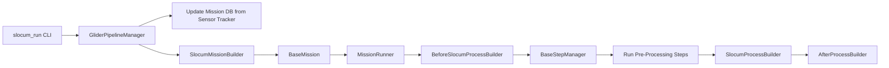
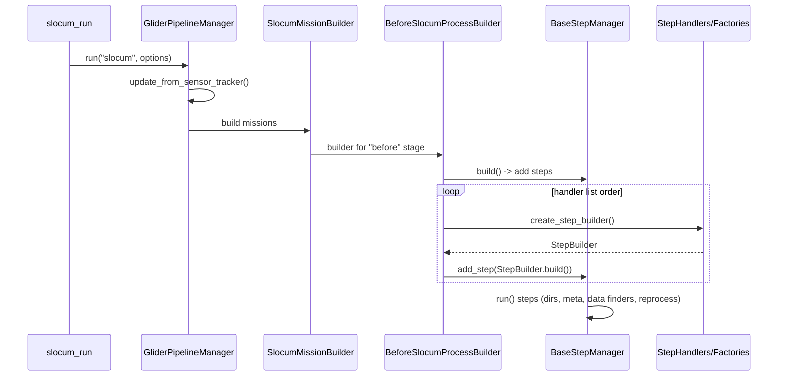

### Pre‑Processing in the Glider Data Pipeline (GDP)

This document explains, in depth, how GDP’s pre‑processing layer is structured and executed. It covers the orchestration
flow, key classes, step handlers, factories, inputs/outputs, error handling, and patterns for extension. It assumes
familiarity with Python and Django.

---

### What “Pre‑Processing” Means Here

In GDP, “pre‑processing” refers to the steps executed before the main data processing (e.g., Slocum ASCII/BIN conversion
into NetCDF). Typical responsibilities include:

- Updating the local Mission database from the Sensor Tracker
- Resolving which missions to run (real‑time, delayed, or explicit list)
- Preparing and validating local directories and file locations
- Discovering and staging input data for the selected missions
- Handling reprocess and maintenance tasks (re‑upload NC, regenerate ERDDAP config)
- Publishing or notifying the command context of metadata discovered/generated

These tasks are assembled by a dedicated builder and powered by modular step handlers.

---

### Key Entry Points and Files

- CLI entry: `gdp/management/commands/slocum_run.py`
- Pipeline manager: `gdp/core/pipeline/manager.py`
- Mission builders: `gdp/core/mission/factory.py`
- Pre‑processing builders:
    - Slocum: `gdp/core/process/before_slocum_process_builder.py`
    - Wave: `gdp/core/process/before_wave_process_builder.py`
- Step handler list for pre‑processing: `gdp/contrib/step_handlers/before_process_step_handlers.py`
- Process builder base: `gdp/core/process/base.py`
- Step manager and step abstractions: `gdp/core/steps/*` (e.g., `manager.py`, interfaces)

---

### Orchestration Flow (Pre‑Processing Context)

1. `slocum_run` parses options and calls `GliderPipelineManager("slocum", options).run()`.
2. `GliderPipelineManager` updates the `Mission` table from Sensor Tracker and selects missions using
   `SlocumMissionBuilder`.
3. Each `BaseMission` is constructed with a list of builders:
   `[BeforeSlocumProcessBuilder, SlocumProcessBuilder, AfterProcessBuilder]`.
4. The MissionRunner executes builders in order. The “Before” builder constructs and runs pre‑processing steps via a
   `BaseStepManager`.

#### Control Flow around Pre‑Processing



---

### The Pre‑Processing Builder

File: `gdp/core/process/before_slocum_process_builder.py`

- Class: `BeforeSlocumProcessBuilder(BaseProcessBuilder)`
    - Sets `step_manager.PROCESS_NAME = "before slocum process"`
    - Provides `get_step_handler_list()` by importing `before_slocum_process_step_handler_list` from
      `gdp.contrib.step_handlers`
- Inherited from `BaseProcessBuilder` (`gdp/core/process/base.py`):
    - `build()` constructs a sequence of steps from handler‑provided builders and adds them to `BaseStepManager`.
    - `add_step_generator()` yields builders constructed from each step handler.

Core builder pattern (simplified):

```python
for step_handler_cls in self.get_step_handler_list():
    step_builder = step_handler_cls(self.mission_dict, self.command).create_step_builder()
    step = step_builder.build()  # may be a no-op based on conditions
    self.step_manager.add_step(step)
```

---

### Step Manager and Steps

- `BaseStepManager` (see `gdp/core/steps/manager.py`) collects and runs steps in order.
- Steps are small, focused executables adhering to a Step interface (e.g., `run(context)`), allowing flexible
  composition and testability.
- A `NoOperationStep` is used when a condition fails (guards allow conditional inclusion without branching complexity in
  the runner).

---

### Pre‑Processing Step Handlers and What They Do

File: `gdp/contrib/step_handlers/before_process_step_handlers.py`

Each handler subclasses a small `BaseStepHandler` and sets a `FACTORY_CLASS` to generate the concrete step
implementation. The handler’s `create_step_builder()` provides a builder that creates the actual Step.

- Re/ maintenance-oriented steps
    - `ReprocessBinaryStepHandler` → `ReprocessBinaryFactory`
        - Re‑queue or re‑build tasks for mission binary data when `--reprocess` or similar conditions apply.
    - `ReprocessAsciiStepHandler` → `ReprocessAsciiFactory`
        - Same as above, targeting ASCII inputs.
    - `ReprocessMetaStepHandler` → `ReprocessMetaFactory`
        - Rebuild metadata artifacts for missions.
    - `ReUploadNCStepHandler` → `ReUploadNCFactory`
        - Push previously built NetCDFs back to the destination (e.g., ERDDAP data dir) if required.
    - `ReGenerateAndUploadErddapConfigStepHandler` → `ReGenerateAndUploadErddapConfigFactory`
        - Regenerate dataset XML and redeploy it (useful after schema/template changes).

- Environment preparation and discovery steps
    - `CreateDirectoriesStepHandler` → `DirectoryCreationFactory`
        - Ensures local directories exist for inputs, outputs, intermediates, logs, and temp storage; honors
          `--keep_middle_process_files` and directory overrides `-R/--resource_dir`, `-O/--output_dir`.
    - `CreateMetaStepHandler` → `CreateMetaJsonBuilder`
        - Discovers mission metadata JSON from `ProcessFiles` table and notifies the `command` with paths for later use;
          works with `gdp.models.ProcessFiles` and `settings.FILE_TYPE["META_JSON"]`.

- Input data location for Slocum
    - `RetrieveSlocumRealtimeDataStepHandler` → `SlocumDataFinderRealtimeFactory`
        - Locates current mission’s real‑time data streams; sets up staging paths.
    - `RetrieveSlocumDelayedDataStepHandler` → `SlocumDataFinderDelayedFactory`
        - Locates delayed/high‑resolution data for requested missions.

- Wave (when platform is wave)
    - `ProcessWaveNetCDFFilesStepHandler` → `WaveNetCDFProcessFactory` (pre‑processing segment for wave missions).

The ordered list exported as `slocum_handler_list` defines the default pre‑processing chain for Slocum:

```python
slocum_handler_list = [
    ReprocessBinaryStepHandler,
    ReprocessAsciiStepHandler,
    ReprocessMetaStepHandler,
    ReUploadNCStepHandler,
    ReGenerateAndUploadErddapConfigStepHandler,
    CreateDirectoriesStepHandler,
    CreateMetaStepHandler,
    RetrieveSlocumRealtimeDataStepHandler,
    RetrieveSlocumDelayedDataStepHandler,
]
```

Execution order matters: reprocess/regen steps typically occur before directory setup and data discovery, ensuring the
environment is coherent for subsequent stages.

---

### Pre‑Processing Class Diagram (Focused)

```mermaid
classDiagram
    class BeforeSlocumProcessBuilder {
        + get_step_handler_list(): list
        + build(): BaseStepManager
    }
    class BaseProcessBuilder {
        +add_step_generator(); +build()
    }
    class BaseStepManager {
        +add_step(step); +run()
    }

    BeforeSlocumProcessBuilder --|> BaseProcessBuilder
    BeforeSlocumProcessBuilder --> BaseStepManager: produces

    class BaseStepHandler {
        <<abstract>>
        FACTORY_CLASS
    }
    class DirectoryCreationFactory
    class CreateMetaJsonBuilder
    class SlocumDataFinderRealtimeFactory
    class SlocumDataFinderDelayedFactory
    class ReprocessBinaryFactory
    class ReprocessAsciiFactory
    class ReprocessMetaFactory
    class ReUploadNCFactory
    class ReGenerateAndUploadErddapConfigFactory

    class CreateDirectoriesStepHandler
    class CreateMetaStepHandler
    class RetrieveSlocumRealtimeDataStepHandler
    class RetrieveSlocumDelayedDataStepHandler
    class ReprocessBinaryStepHandler
    class ReprocessAsciiStepHandler
    class ReprocessMetaStepHandler
    class ReUploadNCStepHandler
    class ReGenerateAndUploadErddapConfigStepHandler

    BaseStepHandler <|-- CreateDirectoriesStepHandler
    BaseStepHandler <|-- CreateMetaStepHandler
    BaseStepHandler <|-- RetrieveSlocumRealtimeDataStepHandler
    BaseStepHandler <|-- RetrieveSlocumDelayedDataStepHandler
    BaseStepHandler <|-- ReprocessBinaryStepHandler
    BaseStepHandler <|-- ReprocessAsciiStepHandler
    BaseStepHandler <|-- ReprocessMetaStepHandler
    BaseStepHandler <|-- ReUploadNCStepHandler
    BaseStepHandler <|-- ReGenerateAndUploadErddapConfigStepHandler
    CreateDirectoriesStepHandler --> DirectoryCreationFactory: FACTORY_CLASS
    CreateMetaStepHandler --> CreateMetaJsonBuilder: FACTORY_CLASS
    RetrieveSlocumRealtimeDataStepHandler --> SlocumDataFinderRealtimeFactory: FACTORY_CLASS
    RetrieveSlocumDelayedDataStepHandler --> SlocumDataFinderDelayedFactory: FACTORY_CLASS
    ReprocessBinaryStepHandler --> ReprocessBinaryFactory: FACTORY_CLASS
    ReprocessAsciiStepHandler --> ReprocessAsciiFactory: FACTORY_CLASS
    ReprocessMetaStepHandler --> ReprocessMetaFactory: FACTORY_CLASS
    ReUploadNCStepHandler --> ReUploadNCFactory: FACTORY_CLASS
    ReGenerateAndUploadErddapConfigStepHandler --> ReGenerateAndUploadErddapConfigFactory: FACTORY_CLASS
```



---

### Pre‑Processing Sequence (Slocum, Delayed)



---

### Inputs and Outputs of Pre‑Processing

- Inputs
    - CLI options (e.g., `--process_delayed_mission`, `-ml`, `-R`, `-O`, `--reprocess`, `--keep_middle_process_files`)
    - Mission data from the DB (`Mission` model), after sync from Sensor Tracker
    - Existing artifacts tracked in `gdp.models.ProcessFiles` (e.g., meta JSON) and settings (`settings.FILE_TYPE`)
    - Filesystem structure (resource and output roots; raw input locations)

- Outputs
    - A populated `BaseStepManager` ready for execution
    - Verified and created directories for subsequent steps
    - Discovered input data paths for the mission (real‑time or delayed)
    - Optional: regenerated ERDDAP XML (if pre‑processing chooses to regen ahead) and re‑uploads of NC files
    - Notifications to `command` containing file paths (e.g., discovered metadata)

---

### Conditional Behavior & Idempotency

- Many steps are conditionally enabled based on CLI options and mission state. The builder pattern supports guards that
  substitute a `NoOperationStep` when conditions don’t hold.
- Directory creation is idempotent; repeated executions won’t fail if directories already exist.
- Reprocess steps avoid duplicating work unless explicitly requested.
- Data finder steps are read‑only or staging‑only; they should not transform data.

---

### Error Handling and Logging

- Each step is executed under the MissionRunner’s supervision. Exceptions are collected; `MissionRunner.raise_error()`
  summarizes failures post‑run.
- Pre‑processing emits structured logs: start/finish of each step and the resolved context (e.g., selected missions,
  directories, found files).
- Some steps validate assumptions (e.g., directory existence, file discoverability) and raise early if critical
  preconditions aren’t met.

---

### Configuration Surface (Common Flags)

- `--process_realtime_mission` / `--process_delayed_mission` or `--live` / `--delayed`
- `-ml/--mission_list`, `-m/--missions` (single/range)
- `-R/--resource_dir`, `-O/--output_dir`
- `--reprocess`, `--keep_middle_process_files`
- `--meta` (downstream metadata generation; in pre‑processing, typically discovery and notification)
- `--test_run`, `--hide_process_bar`, `--slack_notification`

Pre‑processing reads these through the `command` instance supplied to the builder.

---

### Extending Pre‑Processing

1. Create a handler in `gdp/contrib/step_handlers/before_process_step_handlers.py`:
    - Subclass `BaseStepHandler` and set `FACTORY_CLASS`.
2. Implement the factory and step under `gdp/contrib/step_implementation/<your_feature>/...`:
    - Provide a `create_step_builder()` returning a builder whose `build()` yields a Step with `run(context)`.
3. Add your handler to `slocum_handler_list` (or `wave_handler_list` if appropriate). Order matters.
4. Use `ProcessFiles` and `settings` for durable artifact tracking and consistent file typing.

---

### Developer Checklist for Pre‑Processing Issues

- Verify mission selection logic (`SlocumMissionBuilder.get_selected_mission_list`) matches the intended mode.
- Confirm Sensor Tracker sync is succeeding (`GliderPipelineManager.update_from_sensor_tracker`).
- Check directories and permissions (`CreateDirectoriesStepHandler`).
- Validate `ProcessFiles` entries and `settings.FILE_TYPE` for metadata discovery (`CreateMetaStepHandler`).
- Inspect conditional flags that activate reprocess and ERDDAP regeneration handlers.
- Review logs from `BaseProcessBuilder.build()` to ensure all intended steps were added and in the correct order.

---

### Cross‑References

- Before builder: `gdp/core/process/before_slocum_process_builder.py`
- Base builder: `gdp/core/process/base.py`
- Step handlers (pre): `gdp/contrib/step_handlers/before_process_step_handlers.py`
- Mission selection: `gdp/core/mission/factory.py`
- Pipeline manager: `gdp/core/pipeline/manager.py`
- Entry command: `gdp/management/commands/slocum_run.py`