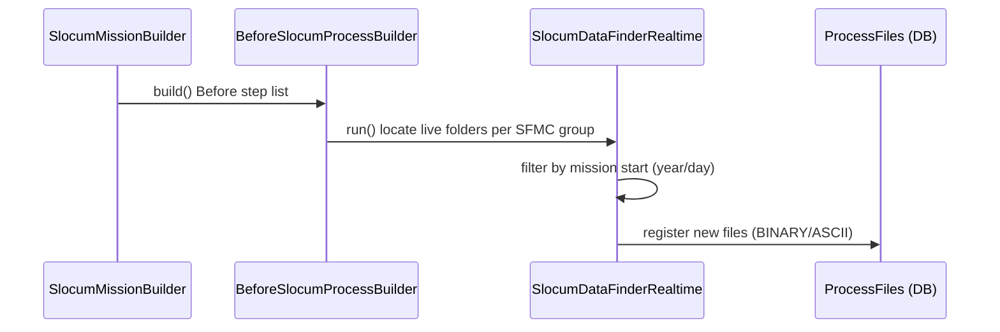
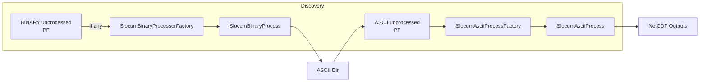
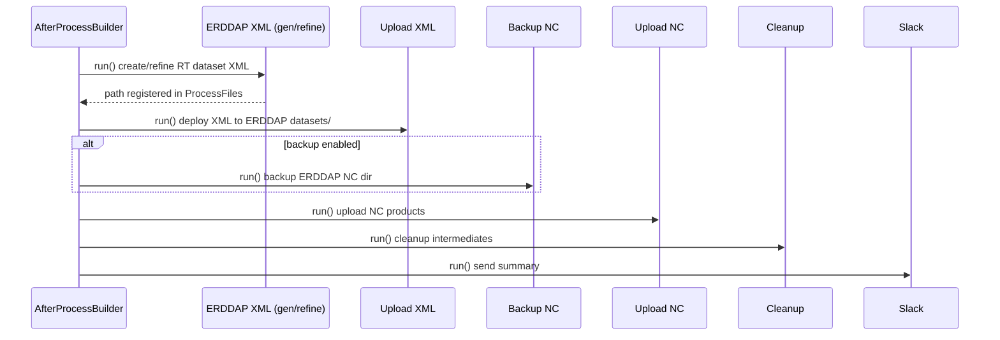

### Real‑Time Mode Data Processing — End‑to‑End Flow (GDP)

This document explains the real‑time processing mode in the Glider Data Pipeline (GDP) from command invocation to ERDDAP
publication. It details the steps, classes, inputs/outputs, idempotency, and error handling. Mermaid diagrams are
included for GitHub Pages.

---

### What “Real‑Time” Means in GDP

- Processes the currently active mission (deployment with no `end_time`) for a Slocum glider.
- Ingests low‑latency telemetry from SFMC/operational folders (e.g., `SBD`, `TBD`, `MBD`, `NBD`).
- Converts binary telemetry to ASCII (when needed), then generates NetCDF files with filtering/decimation suitable for
  near‑real‑time ERDDAP publication.
- Can be run periodically (cron) to pick up newly arrived files.

Key code points:

- CLI command: `gdp/management/commands/slocum_run.py`
- Manager: `gdp/core/pipeline/manager.py`
- Real‑time data finder: `gdp/contrib/step_implementation/file_finder/file_finder.py :: SlocumDataFinderRealtime`
- Core processing builders/steps: `gdp/core/process/data_process_builder.py` and
  `gdp/contrib/step_implementation/slocum_processor_handler/*`
- Post‑processing (ERDDAP): `gdp/core/process/after_process_builder.py`, `gdp/contrib/step_implementation/errdap_*`

---

### High‑Level Flow

1) Command parses options, selects real‑time mode
2) Pipeline Manager updates Mission table from Sensor Tracker and selects the current mission
3) Builds mission with three stage builders: Before (pre), Process (core), After (post)
4) Pre‑processing discovers live data folders and prepares directories; records files
5) Core processing converts any new binaries to ASCII, then builds/update NetCDFs from ASCII
6) Post‑processing updates ERDDAP config (if requested), uploads NetCDFs, performs backups/cleanup, and sends
   notifications

#### End‑to‑End Flow (Real‑Time)

```mermaid
flowchart LR
    A["CLI: manage.py slocum_run --process_realtime_mission"] --> B["GliderPipelineManager"]
    B --> C["Sync Mission DB from Sensor Tracker"]
    B --> D["Select current mission<br/>end_time = None"]
    D --> E["MissionRunner: Before → Process → After"]

    subgraph Before["Pre-Processing"]
        E1["Create local directories"] --> E2["SlocumDataFinderRealtime"]
        E2 --> E3["Register discovered files<br/>ProcessFiles"]
    end

    subgraph Process["Core"]
        P1["Binary → ASCII<br/>if new/unprocessed"] --> P2["ASCII → NetCDF"]
    end

    subgraph After["Post-Processing"]
        A1["Generate ERDDAP XML"] --> A2["Upload ERDDAP XML"]
        A2 --> A3["Backup ERDDAP NC folder"]
        A3 --> A4["Upload NetCDF files"]
        A4 --> A5["Cleanup + Slack"]
    end

    E --> E1
    E3 --> P1
    P2 --> A1
```

---

### Real‑Time Mission Selection

- Manager: `GliderPipelineManager.run()`
    - Refreshes `Mission` records from Sensor Tracker
    - Uses `SlocumMissionBuilder.get_selected_mission_list()` to pick the real‑time mission (deployment with
      `end_time=None`)
- The builder assembles a `BaseMission` with a `command` and the ordered builders: `BeforeSlocumProcessBuilder`,
  `SlocumProcessBuilder`, and `AfterProcessBuilder`.

---

### Pre‑Processing in Real‑Time Mode

- Handler list (subset relevant to real‑time): `RetrieveSlocumRealtimeDataStepHandler` from
  `gdp/contrib/step_handlers/before_process_step_handlers.py`, backed by `SlocumDataFinderRealtimeFactory`.
- Core class: `SlocumDataFinderRealtime` (`gdp/contrib/step_implementation/file_finder/file_finder.py`)
    - Input resource path: root that contains SFMC groups
    - Resolves one or more SFMC groups, then builds live folder paths:
        - Pattern: `<resource_root>/<sfmc_group>/gliders/<platform_name_lower>/from-glider`
    - Filters files by mission start time to avoid ingesting older deployments:
        - Uses regex `'.*-(.*)-(.*)-.*-.*'` against filenames like `glider-yyyy-ddd-...(.sbd|.tbd)`
        - Ensures `year >= mission_start_year` and `yearday >= mission_day_of_year`
    - Recognizes real‑time extensions via `settings.REALTIME_EXTENDED = ("SBD", "TBD", "MBD", "NBD")`
- Outputs:
    - Discovered, mission‑relevant data files registered into `ProcessFiles` (type BINARY/ASCII as appropriate)
    - Ensured/created directories via directory‑creation steps

#### Mermaid: Real‑Time Data Discovery

---

### Core Processing in Real‑Time

- Process builder: `SlocumProcessBuilder` (`gdp/core/process/data_process_builder.py`)
- Handlers: `BinaryProcessStepHandler` and `AsciiProcessStepHandler` (
  `gdp/contrib/step_handlers/data_process_step_handlers.py`)
- Factories: `SlocumBinaryProcessorFactory`, `SlocumAsciiProcessFactory` (
  `gdp/contrib/step_implementation/slocum_processor_handler/factory.py`)

Binary → ASCII (if any new BINARY files):

- Discovery via `ProcessFiles.get_unprocessed_file(..., FILE_TYPE["BINARY"])`
- Output ASCII path: `ProcessDirectory(..., DIRECTORY_TYPE["ascii_path"])`
- Cache dir: `settings.SLOCUM_SHARED_CACHE_DIR`
- Engine call: `gdp.engine.slocum.engine.interface.gutils_api.process_bin(temp_dir, ascii_out, cache)`
- Result normalization and save via `SlocumBinaryProcess.analyze_process_result()` and `SavableObjectStep` contract

ASCII → NetCDF:

- Ensures any manually added `.dat` are tracked (scan ASCII dir)
- Fetches unprocessed ASCII via `ProcessFiles`
- Options (filters) from CLI: `--filter_distance`, `--filter_points`, `--filter_time`, `--filter_z`, `--tsint`
- Produces NetCDFs under `DIRECTORY_TYPE["netcdf_path"]`; persists results via `SavableObjectStep`

#### Real‑Time Core Stage

---

### Post‑Processing in Real‑Time

- Builder: `AfterProcessBuilder` → handlers from `gdp/contrib/step_handlers/after_process_step_handlers.py`
    - Create ERDDAP config (XML) → `ErddapDatasetXMLGeneratorBuilder`
        - Real‑time config variants are supported in the ERDDAP XML factory using helpers like
          `get_realtime_mission_type()` (see `.../errdap_dataset_config/factory/*`).
    - Upload ERDDAP config → `UploadErddapConfigFactory`
    - Backup ERDDAP NC folder → `BackupErddapNcFilesFactory` (optional)
    - Upload NC files → `UploadErddapNcFilesFactory`
    - Files cleaning → `SlocumAfterProcessFilesCleaningFactory`
    - Slack notification → `SlackNotificationFactory`

#### Real-time Post‑Processing Sequence

---

### Control Surface (CLI) for Real‑Time

- Mode selection
    - `--process_realtime_mission` (or alias like `--live`)
- Processing options
    - `-a/--asciiProcess`, `-b/--binProcess` (enable/disable modalities)
    - Filters for ASCII→NC: `--filter_distance`, `--filter_points`, `--filter_time`, `--filter_z`, `--tsint`
- ERDDAP and ops
    - `-c/--config_erddap` (generate XML)
    - `--upload` (upload data)
    - `--keep_middle_process_files` (cleanup policy)
    - `--slack_notification`
    - `--test_run`, `--hide_process_bar`

These flags are parsed by `slocum_run` and propagated via the `command` object to builders and factories.

---

### Inputs and Outputs

- Inputs
    - SFMC live folders: `<resource_root>/<sfmc_group>/gliders/<platform>/from-glider` with realtime file types in
      `settings.REALTIME_EXTENDED`
    - Mission metadata (for XML/meta blocks)
    - CLI filtering/decimation options

- Outputs
    - Registered source files in `ProcessFiles` (BINARY/ASCII)
    - ASCII files created from new binaries
    - NetCDF products in `DIRECTORY_TYPE["netcdf_path"]`
    - ERDDAP dataset XML (real‑time variant)
    - Uploaded XML and NC into ERDDAP instance
    - Backups/cleanup artifacts; Slack notifications

---

### Idempotency & Scheduling Patterns

- Repeated runs are expected in real‑time:
    - Data finder filters by start day to avoid old missions
    - Factories return `NoOperationStep` if nothing new is unprocessed
    - ASCII directory scan adds any manual `.dat` to `ProcessFiles`
- Recommended: schedule via cron/systemd timer at a cadence matching telemetry arrival; ensure concurrency control (
  single runner per mission) if needed.

---

### Error Handling & Observability

- Missing or inaccessible SFMC directories → logged by `SlocumDataFinderRealtime`; pipeline continues with other
  groups/steps
- Engine or conversion failures → captured by `MissionRunner`; `raise_error` summarizes at end of mission
- Upload permission issues (ERDDAP) → fail fast; Slack notification highlights issue
- Use structured logs and Slack to monitor health; verify `ProcessFiles` counts increasing as data arrives

---

### Real‑Time Specific Considerations

- File naming/time filtering assumes SFMC naming convention; adjust regex if upstream changes
- Tune filters (`tsint`, distance/time filters) to balance freshness vs. stability in ERDDAP views
- Ensure `settings.REALTIME_EXTENDED` reflects all incoming extensions from your SFMC provider
- For partial deployments with backfills, prefer running delayed mode separately to avoid mixing policies