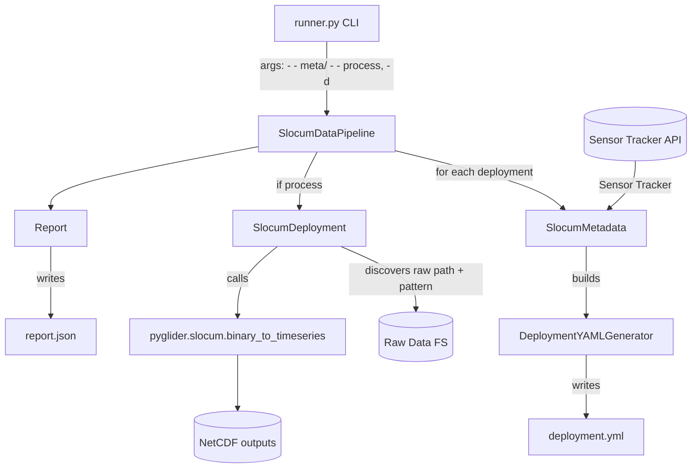
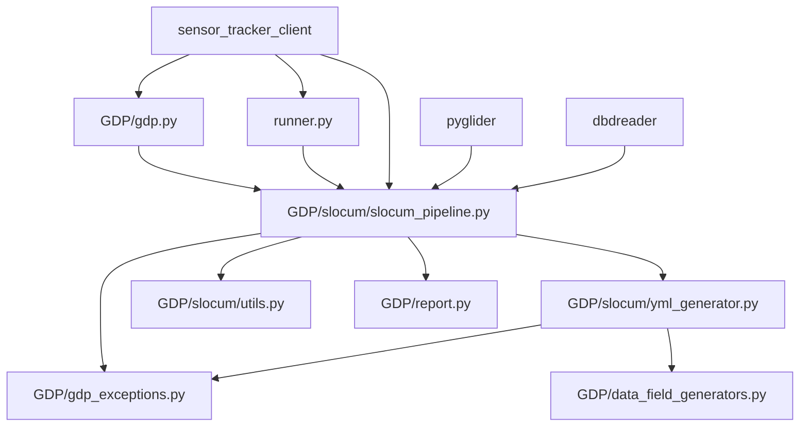
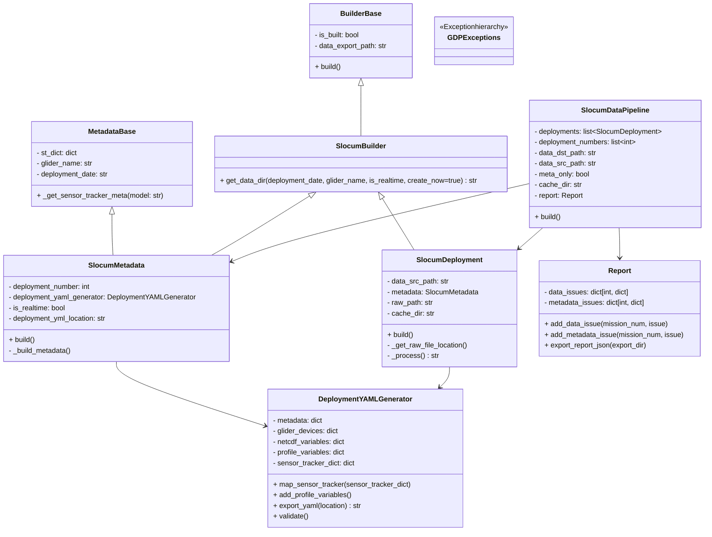
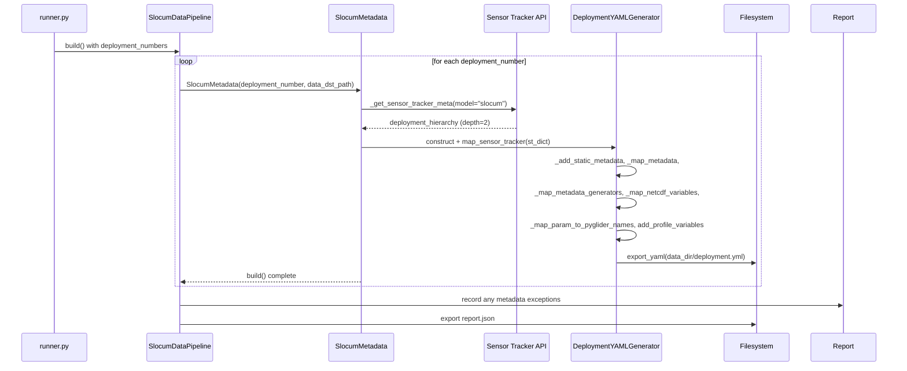
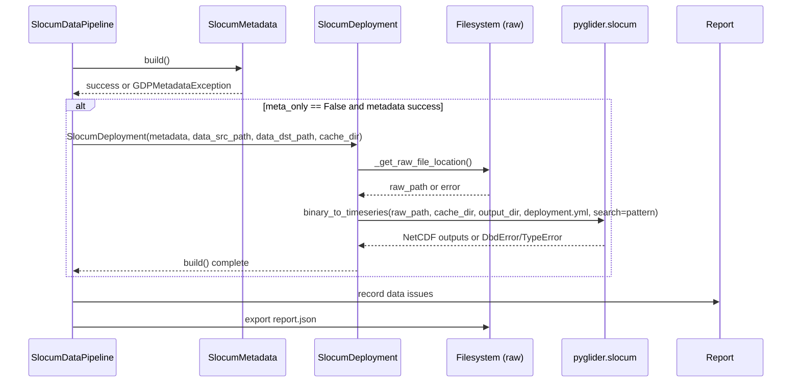
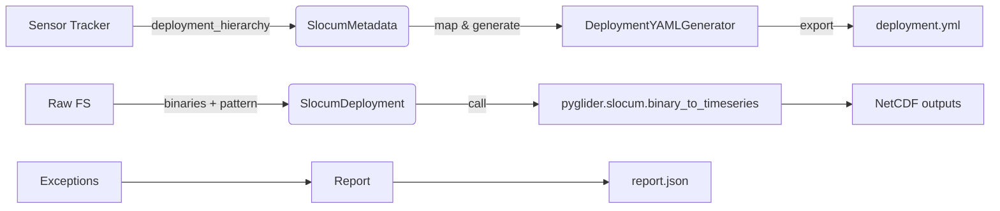
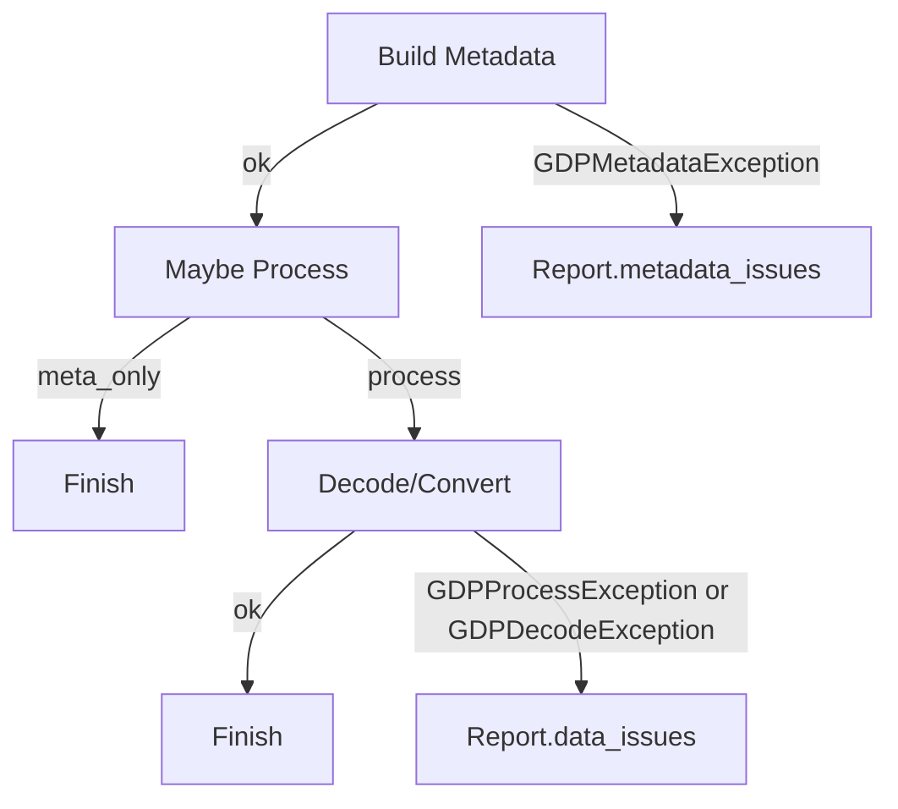
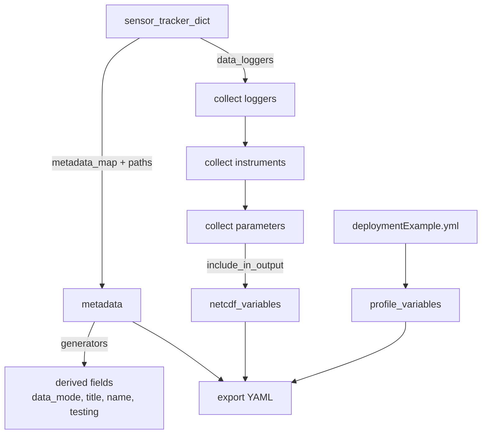

### Glider Data Pipeline 2 Overview

#### Purpose & Scope

The Glider Data Pipeline 2 (GDP2) builds standardized NetCDF datasets and metadata artifacts from glider missions. It
pulls mission metadata from the Sensor Tracker APIs, generates a `deployment.yml` compatible with `pyglider`, and
optionally converts raw Slocum binary files (`DBD/EBD/SBD/TBD`) into published time series NetCDFs.

- Platforms: Slocum (implemented), Wave (skeleton)
- Data sources:
    - Mission metadata from Sensor Tracker API (`sensor_tracker_client`)
    - Raw binary glider files from a filesystem hierarchy
- Outputs:
    - Per-mission deployment YAML used by `pyglider`
    - Time series NetCDF files emitted by `pyglider` into organized export directories
    - A consolidated `report.json` of metadata/data issues encountered

---

### High-Level Architecture



Key flows:

- Metadata-only: Runner → SlocumDataPipeline → SlocumMetadata → Sensor Tracker → DeploymentYAMLGenerator →
  `deployment.yml`
- Full processing: Adds SlocumDeployment which locates raw files and invokes `pyglider` to generate NetCDFs

---

### Module Dependency Graph



---

### Key External Dependencies

- `sensor_tracker_client`: REST client for the Sensor Tracker service
    - Used to discover deployments and fetch full deployment hierarchies (platform, instruments, data loggers,
      parameters)
- `pyglider`: Provides `slocum.binary_to_timeseries` to convert binaries to NetCDF using a `deployment.yml`
- `dbdreader`: Low-level DBD/TBD reader used under the hood by `pyglider`; exceptions surfaced as `DbdError`

---

### Core Classes and Responsibilities (Slocum)



---

### Sequence Diagrams

#### 1) Metadata-only build for a deployment



#### 2) Full processing (metadata + data to NetCDF)



---

### Data & Directory Conventions

- Export base: `data_export_path` (CLI default `./data`)
    - Slocum exports in: `./data/slocum/<glider_name>/<deployment_date>/{nc|nc_rt}`
    - `deployment.yml` saved in that export directory
- Raw source: `data_src_path` (CLI default `/mnt/glider-data-read/`)
    - Realtime path heuristic (both realtime and delayed currently point to realtime path):
        - `/realtime/gmc_gliderbak/default/gliders/<glider_name_lower>/from-glider`
    - File pattern derived from suffixes in the raw dir (e.g., `*.[d|e]bd` for `dbd` & `ebd`)
- Cache dir (required for processing): CLI default `/mnt/glider-data-read/cache`
- Report location: hardcoded to `./data/report.json`

---

### Per-File Walkthrough

- `GDP/gdp.py`
    - `BuilderBase`: common `build()` pattern to mark completion
    - `MetadataBase`: holds common metadata fields and `_get_sensor_tracker_meta(model)` which:
        - Calls `stc.deployment_hierarchy.get({model, deployment_number, depth=2})`
        - Validates exactly one mission is returned
        - Sets `st_dict`, `glider_name`, `deployment_date`

- `GDP/gdp_exceptions.py`
    - Exception hierarchy used across pipeline
        - `GDPException` → `GDPMetadataException`, `GDPProcessException` → `GDPDecodeException`
        - `GDPDataLoggerException` for missing loggers in Sensor Tracker payload

- `GDP/report.py`
    - `Report` collects `metadata_issues` and `data_issues` keyed by deployment number; exports `report.json`
    - Groups issues by error type for summarization

- `GDP/data_field_generators.py`
    - Strategy classes that compute values for specific metadata fields during YAML generation
        - `MetadataModeGenerator`: returns `realtime` if `end_time` is empty; otherwise `delayed`
        - `MetadataTestingDeploymentGenerator`: stringifies `testing_mission`
        - `MetadataNameGenerator`: `<platform.name>_<start_date>` used for `deployment_name` and `title`

- `GDP/slocum/yml_generator.py`
    - `DeploymentYAMLGenerator` maps the Sensor Tracker deployment hierarchy to the pyglider `deployment.yml`
        - `static_metadata` adds constant fields (keywords, license, etc.)
        - `metadata_map` flattens nested keys with `__` path notation; attempts type-coercion to int/float
        - `metadata_generators` uses the `DataFieldGenerator` strategies for derived fields
        - Collects `netcdf_variables` from `data_loggers` → instruments → parameters, filtering by `include_in_output`
        - Renames selected raw parameter identifiers to pyglider names (e.g., `m_lat` → `latitude`)
        - `add_profile_variables()` imports `profile_variables` from the example YAML
        - `export_yaml()` writes the YAML file
        - `validate()` prints missing `old_global_meta` fields (informational)

- `GDP/slocum/utils.py`
    - `get_file_pattern(dir)` inspects suffixes in raw dir and constructs a wildcard for `pyglider` (e.g., `*.[d|e]bd`).
      Raises if more than two suffix types are present.

- `GDP/slocum/slocum_pipeline.py`
    - `SlocumBuilder.get_data_dir(...)` creates/export path and chooses `nc_rt` vs `nc`
    - `SlocumMetadata.build()` obtains Sensor Tracker info and composes `deployment.yml` via `DeploymentYAMLGenerator`
    - `SlocumDeployment.build()` locates raw dir and calls `pyglider.slocum.binary_to_timeseries`
    - `SlocumDataPipeline.build()` orchestrates deployment loop, records exceptions in `Report`, and writes
      `report.json`

- `GDP/wave/wave_pipeline.py`
    - Skeleton for a future Wave platform; methods stubbed and not yet integrated into CLI

- `GDP/deploymentExample.yml`
    - Example YAML from `pyglider` repository; used to seed `profile_variables`

- `runner.py`
    - CLI to invoke the Slocum pipeline
        - `--meta`: generate YAML only (default)
        - `--process`: also run binary-to-timeseries via `pyglider`
        - `-d/--deployment_num`: one or more deployment numbers; special case `0` means "all deployments" from Sensor
          Tracker
    - Paths are currently constants at top of the file

- `requirements.txt`
    - Declares `dbdreader`, `pyglider`, `sensor_tracker_client`

---

### End-to-End Data Flow Diagram



---

### Error Handling & Reporting

- Metadata phase
    - Sensor Tracker failures or structural issues should be raised as `GDPMetadataException` (some are raised
      indirectly via lookups)
    - Missing data loggers cause `GDPDataLoggerException`
- Processing phase
    - Raw path absence → `GDPProcessException`
    - Decoding errors → `GDPDecodeException` (wraps `dbdreader.DbdError` and `TypeError`)
- All exceptions per deployment are aggregated in `Report` and exported as JSON grouped by error type.



---

### Configuration & Paths

- Runner constants (edit to your environment):
    - `DATA_DIR = "./data"` (export base)
    - `DATA_SRC = "/mnt/glider-data-read/"` (mount with raw data)
    - `CACHE_DIR = "/mnt/glider-data-read/cache"`
- Sensor Tracker host is set in both `GDP/gdp.py` and `runner.py`:
    - `https://ceotr.ca/sensor_tracker/`
- YAML output path is created by `SlocumBuilder.get_data_dir()` and includes realtime/delayed selector (`nc_rt` vs `nc`)

---

### How to Run

1. Install dependencies (preferably in a virtualenv):

```
pip install -r requirements.txt
```

2. Generate YAML(s) for specific deployment(s):

```
python runner.py --meta -d 12345
```

3. Generate YAML(s) for all Slocum deployments known to Sensor Tracker:

```
python runner.py --meta -d 0
```

4. Generate YAML and process raw data to NetCDF for deployment(s):

```
python runner.py --meta --process -d 12345
```

Outputs will appear in `./data/slocum/<glider>/<date>/{nc|nc_rt}` with `deployment.yml` and NetCDF outputs (if
`--process` is used). A summary `./data/report.json` is always written.

---

### Notable Design Choices & Considerations

- YAML generation validates presence of legacy `old_global_meta` keys only by printing; it does not fail builds
- `data_mode` is derived from presence of `end_time`:
    - empty end_time → `realtime` (export directory `nc_rt`)
    - otherwise → `delayed` (export directory `nc`)
- Parameter export depends on Sensor Tracker’s `include_in_output` flags
- Raw file search pattern is constructed from observed suffixes and passed to `pyglider`, minimizing assumptions
- Delayed-path logic currently points to the realtime path (TODO per code comment)

---

### Extensibility: Adding Wave Platform

- Mirror the Slocum architecture:
    - Implement `WaveBuilder.get_data_dir()`
    - Populate `WaveMetadata.build()` to fetch and map Sensor Tracker metadata (likely with a Wave-specific YAML
      generator)
    - Implement `WaveDeployment` to discover raw Wave files and call the appropriate converter
    - Create `GDP/wave/yml_generator.py` with Wave mapping rules
    - Wire up a `WaveDataPipeline` and a CLI switch

---

### Glossary

- Sensor Tracker: Source-of-truth service for platforms, deployments, instruments, parameters
- Deployment YAML (`deployment.yml`): Configuration file required by `pyglider` to convert raw files
- Realtime vs Delayed: Indicates whether a deployment is ongoing (`end_time == ""`) or completed

---

### Detailed YAML Mapping Logic



---

### File-Level API Summary

- Builders: `BuilderBase.build()`, `SlocumBuilder.get_data_dir(...)`
- Metadata:
    - `MetadataBase._get_sensor_tracker_meta(model)`
    - `SlocumMetadata.build()`
- YAML Gen:
    - `DeploymentYAMLGenerator.map_sensor_tracker(dict)`
    - `DeploymentYAMLGenerator.add_profile_variables()`
    - `DeploymentYAMLGenerator.export_yaml(path)`
    - `DeploymentYAMLGenerator.validate()`
- Processing:
    - `SlocumDeployment.build()`
    - `get_file_pattern(raw_dir)`
- Orchestration:
    - `SlocumDataPipeline.build()`
    - `Report.add_*_issue()`, `Report.export_report_json(dir)`

---

### Known TODOs and Potential Enhancements

- Separate configuration from code (e.g., use env vars or a config file for paths and ST host)
- Implement a proper delayed data path (currently mirrors realtime)
- Improve validation: fail on critical missing metadata rather than just printing
- Add logging instead of `print`
- Add tests: unit tests for mapping, file pattern, and pipeline orchestration
- Implement the Wave pipeline
