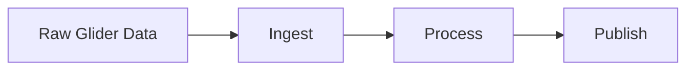

# OTN Glider Documentation

Welcome to the OTN Glider Documentation site. Use the navigation to explore how-to guides and the Glider Data Pipeline overview.

## Quick start

- Edit content in the `docs/` folder
- Run locally: `mkdocs serve`

## Diagrams (Mermaid)

## Math (MathJax)

Inline example: $e^{i\pi} + 1 = 0$.

Block example:

$$
\nabla \cdot \vec{F} = \frac{\partial F_x}{\partial x} + \frac{\partial F_y}{\partial y} + \frac{\partial F_z}{\partial z}
$$
